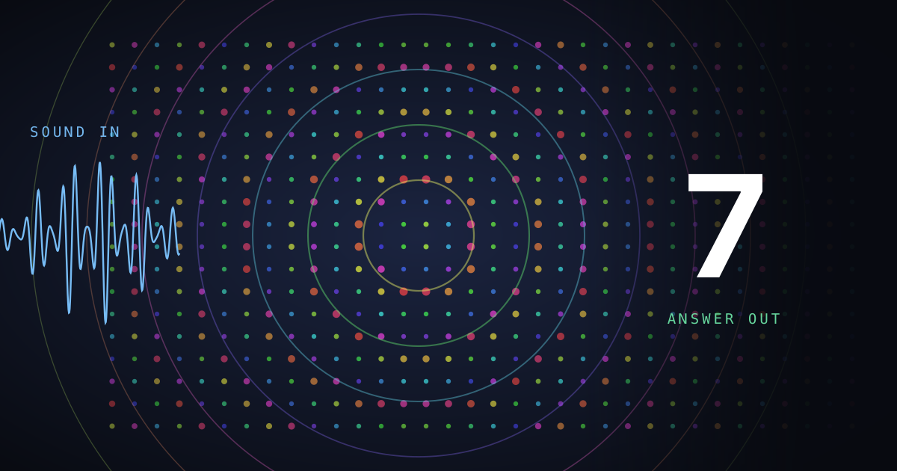

# oscillator-research



> Scientific research into coupled oscillators as a computational substrate for speech recognition and generation.

## What this is about

A coupled-oscillator network is a population of rhythmic units that pull each other toward phase agreement. Wire them onto a geometric structure with a coupling function and drive them with sound, and the field's collective state becomes a representation of that sound. The physics does the transducing, and what you read out is the network's own response to the input.

The idea is old. It runs from Huygens noticing in 1665 that two pendulum clocks on one beam fall into step, through the Hopf model of the cochlea, reservoir computing, and Mead's case for letting physics do the computing directly. What is new is that three fields have arrived at the same dynamics from different directions. Physics now describes synchronization regimes that exhibit computational properties rather than mere order. Neuroscience has identified the neuron as a complex chemical and physical system with functional oscillatory properties. Machine learning has recently produced oscillator architectures that are effective at classification, image generation and path navigation, with evidence suggesting that oscillatory neural networks can be trained, learn, remember and reason.

That convergence is the motivation here. The working hypothesis is that a substrate whose native operations are resonance and entrainment more closely resembles the biological neurons that evolution refined to sense and learn from signals in the physical world, and that a trainable model built from those dynamics would make questions about learning, forgetting and rhythm disruption addressable in simulation.

Speech is the natural place to press on it, because speech is oscillation at every scale: prosody near 1 Hz, syllable rhythm at 4-8 Hz, phone transitions at 10-40 Hz, pitch and formants from 100 Hz to several kHz. An oscillator field is a frequency-selective medium with intrinsic timescales, locking behaviour and spatial wave modes, which is the representational vocabulary that structure would seem to want.

Whether any of that survives contact with controlled measurement is the open question, and it is the question this research addresses. The work is deliberately small-scale and control-heavy: single-variable comparisons, pre-registered decision criteria written before each run, no-dynamics floors under every accuracy, parameter-matched conventional baselines, and randomized twins for every designed structure. Negative results are reported with the same weight as positive ones.

Every paper ships with the code and the raw per-run data that produced its numbers, so any claim here can be peer reviewed and validated or refuted.

## Papers

| # | Paper | What it does |
|---|---|---|
| 01 | [From Synchronization Physics to Trained Dynamics: A Survey of Oscillator Networks in Machine Learning](papers/01-evidence-audit/from-synchronization-physics-to-trained-dynamics.md) | A critical survey of oscillator networks in machine learning, tracing the idea from Huygens in 1665 to the current revival and drawing on 128 sources across physics, mathematics, neuroscience and neuromorphic computing. It sorts thirteen published systems by what is actually learned, and finds that of the fifty-five control comparisons that would isolate the physics, seven have been run. |
| 02 | [Spoken-Digit Recognition Without Training: Geometry, Coupling, and Drive Effects in Frozen Oscillator Fields](papers/02-untrained-reservoirs/) | Freezes every physics parameter of a 1,024-oscillator field and measures spoken-digit recognition across 1,940 pre-registered runs. Untrained fields beat every trained baseline at matched parameter count, yet clear their own no-dynamics floor by only about three points, and none of the six coupling laws, six geometries or three drive pathways moves the result. |

## Layout

```
papers/
├── 01-evidence-audit/
│   ├── README.md
│   ├── from-synchronization-physics-to-trained-dynamics.md   the manuscript
│   ├── ….html .epub .docx                                    built beside it
│   ├── …-tmlr.pdf  …-tmlr.tex  …-arxiv.tar.gz                submission builds
│   ├── metadata/    front matter, and how to cite this paper
│   └── references/  the works it cites
└── 02-untrained-reservoirs/
    ├── … the same, plus
    ├── src/         harness, sweep driver, tests
    ├── results/     the record: 1,940 experiment runs
    └── resources/   figures and audio

publishing/          the scripts that turn a manuscript into those formats
```

Each paper is self-contained: the manuscript, the formats built from it, the bibliography it cites, and its own citation metadata all live in one folder.

## Publishing

The manuscripts are plain Markdown. `publishing/` turns them into every other format without touching the source, writing each one beside the Markdown it came from. Ultimately producing a styled HTML page, EPUB, DOCX, a TMLR submission build against the journal's own style file, and a ready-to-upload arXiv bundle:

```bash
bash publishing/publish.sh
```

Citations are resolved against a real bibliography whose author lists, titles, venues and years come from the DOI registries and DBLP rather than from prose. Every build runs a set of checks over the sources and fails loudly rather than shipping something wrong: whether any entry is too incomplete to publish, whether a citation label is claimed by two different works, whether every system and
author is cited where it is first named, whether every "Section 2.3.3" and "Appendix D" pointer resolves, whether the section numbers in the headings are still current, and whether any invisible character has found its way into the source. Section numbers are written into the Markdown itself, so a cross-reference read on GitHub points at a heading you can see.

To cite one of these papers, see the citation section in its README ([Paper 01](papers/01-evidence-audit/README.md#citing-this-paper), [Paper 02](papers/02-untrained-reservoirs/README.md#citing-this-paper)) — or [CITATION.cff](CITATION.cff) for the repository as a whole. More details in [publishing/README.md](publishing/README.md).

## Data

Speech corpora are not committed. Paper 02 uses [AudioMNIST](https://github.com/soerenab/AudioMNIST); download it and build the
local bank as described in that paper's README.

## License

[Apache 2.0](LICENSE).
