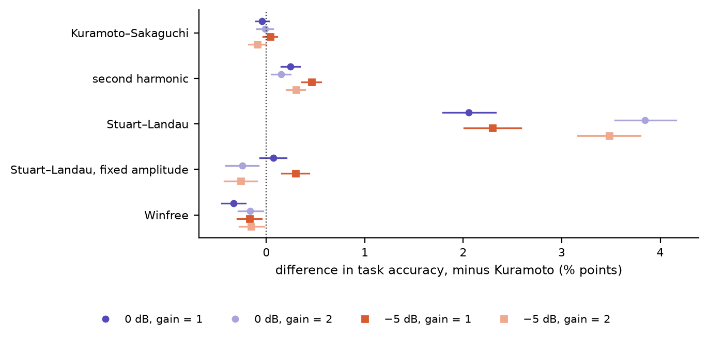
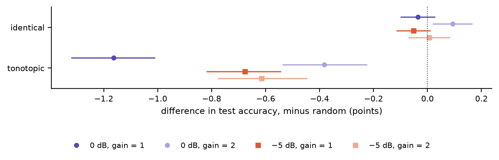

# Spoken-Digit Recognition Without Training: Geometry, Coupling, and Drive Effects in Oscillator Networks

## Abstract

Coupled-oscillator networks are gaining interest as a machine-learning substrate, on the premise that oscillator physics turns signals into useful structure. Yet the ablations that would isolate what the oscillator dynamics contribute are rarely run. We run them for untrained coupled oscillator networks, using spoken-digit classification on AudioMNIST as the measure. A small untrained network is read by a closed-form linear readout and compared with five trained conventional networks (GRU, TCN, CNN, transformer and S4D) matched in parameters and with three controls: the same network with its coupling removed, a non-oscillating bank of leaky integrators with the same states and parameters, and the same readout fitted directly to the network's input. Every experimental arm's state is summarized by the same time-pooled statistics and spoken digits classified using the same number of features, so that readout capacity cannot mask dynamics. The ablations, eight experiments of 6,353 runs in all, vary six coupling functions, eight lattice geometries, and the natural frequencies, input pathway, input gain, readout width and training set size, on digit recognition and on a temporal order task that order-blind readouts cannot solve. The design separates three explanations for an untrained network's accuracy: its input representation, the width of its readout, and the oscillator dynamics and structure itself. Our ablation study results give future studies of trained oscillator networks an untrained baseline to compare against for speech recognition tasks, and insight into which factors contribute to an oscillator network's effectiveness on time series tasks.

## 1 Introduction

Every sense we have transduces a physical signal, and the oscillation and synchronization recorded in neural populations as they track speech ([Assaneo et al. 2020](https://doi.org/10.1038/s41562-020-00962-0); [Doelling et al. 2023](https://doi.org/10.1371/journal.pcbi.1011669); [Pittman-Polletta et al. 2021](https://doi.org/10.1371/journal.pcbi.1008783); [Dogonasheva et al. 2026](https://doi.org/10.1016/j.neunet.2025.108194)) are consistent with neurons acting, in part, as coupled oscillators. We do not test that conjecture here. It motivates a narrower question: where are the useful boundaries of oscillatory neural networks, and what do their dynamics contribute?

A recent survey of oscillator networks in machine learning ([Kryski 2026](https://doi.org/10.2139/ssrn.7445198)) found the ablations that would answer that question largely missing: the coupling term had been removed as a single variable only three times, coupling functions had been compared only within the Kuramoto family ([Nunley 2026](https://arxiv.org/abs/2606.18694)) and, on graphs, as Stuart–Landau against Kuramoto without fixing the amplitude ([Zhang et al. 2026](https://doi.org/10.1145/3774904.3792675)). No study varied the lattice geometry or its boundaries as a single variable at a matched budget, and none contrasted different audio input structures under controls. We address those gaps on one task, spoken-digit recognition, where automatic speech recognition began ([Davis et al. 1952](https://doi.org/10.1121/1.1906946)) and a standard benchmark for oscillator reservoirs built in hardware ([Torrejon et al. 2017](https://doi.org/10.1038/nature23011); [Shougat et al. 2023](https://doi.org/10.1038/s41598-023-35760-x)). An untrained coupled oscillator network, read by a linear readout, is tested under six coupling functions and eight lattice geometries, among them a coil and a cochlea, and compared with the readout applied to its input alone, the same network uncoupled, leaky-integrator banks of the same size and five trained networks of the same parameter count, on AudioMNIST ([Becker et al. 2024](https://doi.org/10.1016/j.jfranklin.2023.11.038)) with held-out speakers and added noise. Untrained networks of coupled oscillators have recognized spoken digits before, in simulation and on TI-46 with the same speakers in training and test ([Opala et al. 2019](https://doi.org/10.1103/PhysRevApplied.11.064029); [Coulombe et al. 2017](https://doi.org/10.1371/journal.pone.0178663)). To our knowledge none have been tested on held-out speakers with added noise against their input alone and their own uncoupled form. Additionally, we found no AudioMNIST result that combines held-out speakers with added noise. The two studies we found that add noise on AudioMNIST share speakers between training and test ([Beoletto et al. 2026](https://doi.org/10.1002/aisy.202500526); [Young et al. 2026](https://doi.org/10.1186/s13636-026-00457-2)).

## 2 Background

Coupled oscillators synchronize, form clusters, lock to a drive or split into coherent and incoherent domains, depending on how they are coupled and arranged ([Pikovsky et al. 2001](https://doi.org/10.1017/CBO9780511755743); [Strogatz 2000](https://doi.org/10.1016/S0167-2789%2800%2900094-4); [Kuramoto & Battogtokh 2002](https://arxiv.org/abs/cond-mat/0210694); [Abrams & Strogatz 2004](https://arxiv.org/abs/nlin/0407045)). Machine learning has used them two ways. Untrained, as reservoirs read by a trained linear readout ([Jaeger 2001](https://www.ai.rug.nl/minds/uploads/EchoStatesTechRep.pdf); [Maass et al. 2002](https://doi.org/10.1162/089976602760407955); [Tanaka et al. 2019](https://doi.org/10.1016/j.neunet.2019.03.005)): a spintronic oscillator recognized spoken digits in hardware ([Torrejon et al. 2017](https://doi.org/10.1038/nature23011)), though much of that accuracy came from its cochlear front end ([Abreu Araujo et al. 2020](https://doi.org/10.1038/s41598-019-56991-x)), whose authors therefore report a reservoir's gain over its front end alone and test it on held-out speakers in noise on another corpus. On AudioMNIST, a simulated network of 128 coupled protonic nickelate devices, a neuromorphic element that does not oscillate, read above the same network uncoupled and above a readout of the unprocessed input ([Zhou et al. 2026](https://doi.org/10.1038/s41565-026-02133-0)), which inspired one of the controls used in our study. Trained oscillatory neural networks (ONNs), structured as layers whose coupling or frequencies are learned, have been applied to various tasks: Neural Wave Machines, an oscillator lattice, on sequence classification and forecasting simple physical systems ([Keller & Welling 2023](https://proceedings.mlr.press/v202/keller23a.html)), AKOrN on unsupervised object discovery, adversarial robustness, uncertainty calibration and Sudoku ([Miyato et al. 2025](https://openreview.net/forum?id=nwDRD4AMoN)), WONN on image recognition, Sudoku and maze solving ([Dai & Song 2026](https://arxiv.org/abs/2605.20922)), FSN on character-level language modelling ([Nunley 2026](https://arxiv.org/abs/2606.18694)), Un-0 on image generation ([unconv.ai 2026](https://unconv.ai/blog/introducing-un-0-generating-images-with-coupled-oscillators/)) and coupled oscillatory recurrent networks (coRNN, [Rusch & Mishra 2021](https://openreview.net/forum?id=F3s69XzWOia)), one of which reached 89% on AudioMNIST from the raw waveform with a random, not speaker-disjoint, split ([Chandravadia & Imam 2026](https://doi.org/10.1016/j.patter.2026.101563)). Most adopt one coupling function and one arrangement, and the survey found that few share a benchmark, AKOrN and WONN on Sudoku among them, and fewer share a protocol ([Kryski 2026](https://doi.org/10.2139/ssrn.7445198)). Here one task is held fixed and the coupling function, the geometry and the input are varied across it, on untrained networks, so that each can be compared with controls in future training experimentation.

## 3 Methods

### 3.1 Design

This study asks whether an untrained coupled oscillator network carries information for recognizing spoken digits beyond its input alone, beyond a non-oscillating memory of the same size and beyond the same oscillators uncoupled; how trained networks of the same parameter count compare; whether the coupling function, lattice geometry, natural frequencies, restoring strength, coupling ceiling, input pathway and input gain change the answer; how the answer changes with the readout's width and the training data; and whether an untrained network can _remember_ the order of events. It ran as eight experiments with 6,353 single-control ablation experimentation runs in total. Every run is one arm at one noise level, input gain and seed executed three times with a different seed each time. The code and every run's record, with a README for each experiment and a summary of every result, are in the supplementary material, and Appendix A defines every term.

Every oscillator network is 4 channels of a 16 × 16 lattice, 1,024 oscillators, and each oscillator's phase evolves as θ̇ᵢ = ωᵢ + couplingᵢ + g·uᵢ − λ sin θᵢ: its natural frequency, the coupling from the other oscillators of its channel through a random kernel whose spectrum is capped at the _coupling ceiling_, the input at gain g, and a restoring pull of strength λ. Row r of every channel is driven by mel band r. The six coupling functions (Kuramoto, Kuramoto–Sakaguchi, second harmonic, Winfree, and Stuart–Landau with and without its amplitude) differ only in the coupling term, and a lattice geometry changes only which oscillators are neighbours (see Appendices B and C). The reference configuration is Kuramoto coupling on the torus with random natural frequencies, restoring strength 0.3 and coupling ceiling 1.

The arms compared with it are the **spectrogram-only baseline**, the readout applied directly to the input; the **uncoupled oscillator network**, the same network with its coupling kernels set to zero; two untrained **leaky-integrator banks**, one matched to the network's 1,024 states and 2,048 parameters and one to its 2,048 exposed signals; and five **trained baselines** (GRU, a dilated residual TCN, CNN, transformer and S4D) of 1,840 to 2,109 parameters, trained end to end (AdamW, 30 epochs) through a learned linear layer on the same statistics the readout reads, standardized. The four untrained dynamical arms are the reservoirs.

### 3.2 Task, data and noise

We perform single digit audio classification over AudioMNIST ([Becker et al. 2024](https://doi.org/10.1016/j.jfranklin.2023.11.038)), which holds 30,000 recordings of digits 0 through 9 by 60 speakers. Every result keeps speakers apart to avoid a model overfitting to a particular speaker's vocal spectrogram. Under Protocol A the arms train on speakers 1 to 48 and test on all 6,000 recordings of speakers 49 to 60, an 80/20 split by speaker, with training sets of 2,048 clips (8,192 and 24,000 in the training-size comparison). Under Protocol B they follow Becker et al.'s five speaker folds (60/20/20). Because the clean task nearly saturates, white noise is added to every clip at signal-to-noise ratios of 0 dB (as loud as the speech) and −5 dB (5 dB louder), the levels at which [Young et al. 2026](https://doi.org/10.1186/s13636-026-00457-2) trained hybrid real and complex-valued convolutional networks on AudioMNIST, though they did so on a random audio sample split so were not speaker disjoint. We also report clean audio for posterity. Additionally, we performed an order task on five different digit pairs where two digits of a pair are spoken one after the other and the arm must say which came first. Statistics of an input read over the whole span cannot tell the orders apart, so the spectrogram-only baseline reads chance, 50%. Every arm hears the same fixed front end, a 16-band log-mel spectrogram at 62.5 frames per second, without training on this task besides the single digit training methodology.

### 3.3 Readout

Every arm is read the same way (Appendix D.1 draws the read for each kind of arm). Each of its signals (a band energy, the sine or cosine of an oscillator's phase, a leaky integrator's state or a trained baseline's hidden unit) is summarized by its mean, standard deviation and mean absolute change over each of four equal windows of frames 16 to 61, after a 16-frame warm-up (frames 16 to 147 as one window for the order task). So that readout capacity cannot obscure dynamics, every arm is read at the same width, 192 standardized features. That is exactly the spectrogram-only baseline's own number of features (16 mel bands by 3 statistics by 4 windows), so the input is read without compression, and it is the native width of four of the five trained baselines. Arms with more features, the reservoirs (12,288 to 24,576) and the GRU (216), are projected down to 192 by a random Gaussian matrix ([Johnson & Lindenstrauss 1984](https://doi.org/10.1090/conm/026/737400)). Arms with fewer features, the baseline and the trained baselines on the order task (48 to 54), are read as they are. Widths of 1,024 and 4,096 show what the projection costs in terms of classification quality. The features are classified by one linear layer fitted by ridge regression in closed form, the reservoir-computing standard ([Jaeger 2001](https://www.ai.rug.nl/minds/uploads/EchoStatesTechRep.pdf); [Lukoševičius 2012](https://doi.org/10.1007/978-3-642-35289-8_36)) and the weakest reader that can be fitted identically for every arm. The projection matrix is drawn once, from a fixed random seed, and the same matrix serves every run of the same native width whatever its run seed, so the spread over seeds leaves out the projection's own randomness; the controls experiment's reservoirs are also read through a matrix drawn from each run's seed, which includes it. The spectrogram-only baseline is read over the whole clip, its primary form, and from frame 16, the frames every other arm is read over.

### 3.4 Input pathways and gain

The audio drives a reservoir in one of two ways as an A/B comparison: the **spectrogram** pathway adds each band's energy to the rotation rate of its row's oscillators, and the **quadrature** pathway adds a phase-referenced push g·Aᵣ sin(φᵣ − θᵢ), the injection form of [Adler 1946](https://doi.org/10.1109/JRPROC.1946.229930), so an oscillator can lock to its band's own cycle. Only the coupled networks run on the quadrature pathway, beside its own spectrogram-only baseline, which reads the quadrature front end directly: a leaky integrator has no phase for the push to act on, the trained baselines take the input as features rather than as a drive, and the uncoupled network was left out because the question is whether coupled oscillators can use a phase-referenced drive at all. Input gain scales the input into a reservoir; it is run at gains of 1 and 2 throughout and swept from 0.25 to 12 for the reference configuration of each coupling function, below the integrator's bound ([Hairer et al. 1993](https://doi.org/10.1007/978-3-540-78862-1)). The spectrogram-only baseline and the trained baselines do not have gain applied because the readout's standardization removes any fixed scale from the directly read spectrogram input, and the trained models learn their own.

### 3.5 Reporting

Every task accuracy result reported is the mean over replicates (three seeds; five folds under Protocol B) ± the sample standard deviation, and every comparison between two arms is paired on the same test clips, condition and seed, reported as the mean difference ± its standard deviation over seeds and a 95% interval from 2,000 paired bootstrap resamples of the test clips. The primary cross model comparator is the four-window read, 2,048 training clips and readout width of 192.

## 4 Results

### 4.1 The network against its controls and the trained baselines

Figure c3-recognition-arms shows every arm at the primary cell, and the supplementary material gives the tables. The spectrogram-only baseline read 93.6%, 78.0% and 71.6% on clean audio, at 0 dB and at −5 dB, and the Kuramoto network at gain 1 read 91.1%, 77.8% and 70.7%: within a point of its input with noise (−0.23 [−0.99, +0.52] at 0 dB, −0.88 [−1.66, −0.09] at −5 dB) and 2.53 points below it on clean audio, but 7.5 to 15.9 points above the input read over the same frames, from frame 16. It read 0.43 to 1.08 points above the uncoupled network, and about 4 points above the state-matched leaky-integrator bank with noise but 2.35 points below it on clean audio; gain 2 read lower than gain 1 for every control reservoir. The Stuart–Landau network read 93.9%, 80.3% and 73.0% (gain 1), within its input on clean audio (+0.28 [−0.19, +0.77]) and above it in every noisy condition (Section 4.3). With noise every trained baseline read above the Kuramoto network, from 79.2% (CNN) to 82.8% (GRU) at 0 dB and 72.3% (transformer) to 76.9% (GRU) at −5 dB, with the Stuart–Landau network in their range; on clean audio they read 94.7% to 97.0%. On the speaker folds of [Becker et al. 2024](https://doi.org/10.1016/j.jfranklin.2023.11.038) (clean, 18,000 training clips), the baseline read 96.0 ± 1.7%, the network 91.9 ± 3.1% (96.9 ± 1.3% at width 4,096) and the trained baselines 97.0% to 98.4%, against 95.8% reported for AlexNet on spectrograms.

### 4.2 Temporal order

Figure c8-order-arms shows every arm on the two digit ordered classification task, averaged over the five digit pairs; the supplementary material gives the table. The spectrogram-only baseline read 49.8% to 50.6% on the order task in every condition. The Kuramoto network read 97.7%, 96.2% and 95.5% at gain 1 (clean, 0 dB, −5 dB), 45.4 to 47.9 points above it; uncoupled, it read 2.2 to 8.5 points lower at gain 1 and 10.4 to 18.7 points lower at gain 2. Both leaky-integrator banks read 98.7% to 99.9%, 2.2 to 7.5 points above the network. The transformer and GRU read 99.0% to 99.9%, the S4D 96.9% to 99.1% and the TCN 91.1% to 99.9%. The CNN read 92.2% on clean audio and chance with noise: its two convolutions see 9 frames (144 ms), less than a digit, so with no memory beyond that window it can tell the orders apart only where one digit meets the other, a cue the noise masks.

### 4.3 Coupling function

The design experiment varied the coupled network one factor at a time around the reference: six coupling functions, six lattice geometries and three kinds of natural frequencies, crossed with two restoring strengths and two coupling ceilings, 312 configurations at 0 and −5 dB, gains 1 and 2 and three seeds, each level paired with its reference over every configuration matching it in the other factors (Figure c4-coupling-functions). The **Stuart–Landau** network, whose oscillators have a free amplitude, read 2.1 to 3.8 points above its Kuramoto match, the largest difference in the experiment, and at the reference configuration it read above the whole-clip baseline in all four noisy conditions, by 1.14 to 2.31 points with every interval above zero; with its amplitude fixed it read within 0.3 points of Kuramoto. The other phase coupling functions differed from Kuramoto by at most 0.46 points.

### 4.4 Lattice geometry and natural frequencies

Every **lattice geometry** in the design experiment read within 0.65 points of the torus, the sphere and sheet lowest (Figure c4-lattice-geometries). A **coil**, one open line from base to apex with one octave per turn, read within 0.22 points of the torus; a **cochlea**, the coil with a one-way base-to-apex coupling and coupling that grows with the coil's curvature toward the apex, read 0.41 to 0.97 points below the torus. Part of that gap is the cochlea's weaker coupling: capping its curvature weights at the apex halves its average coupling, and a control at the coil's average coupling read 0.28 to 0.71 points above the cochlea, yet 0.40 to 0.47 points below the coil at gain 1 and within 0.12 points of it at gain 2.

Each oscillator's **natural frequency** is its rate of rotation when nothing acts on it. The reference draws each at random with mean 1 and standard deviation 0.1, unrelated to the band that drives it. **Tonotopic** frequencies order the rates by band, as the cochlea orders pitch by place: the rate rises a quarter octave per row, from 0.41 in the row of the lowest mel band to 5.5 in the highest, jittered by 5%. **Identical** frequencies set every rate to 1. Tonotopic frequencies read 0.38 to 1.16 percentage points below random ones, and identical ones within 0.1 (Figure c4-natural-frequencies).

### 4.5 Restoring strength, coupling ceiling and gain

How strongly an oscillator returns to it's original position, it's restoring strength, of 0.1 read 0.13 to 0.23 points below 0.3, and a coupling ceiling of 0.5 read 0.39 to 0.68 points below 1. A sweep beyond these levels, for every coupling function at the reference configuration, found restoring strengths of 0.5 to 1.0 moving the phase-oscillator networks by −1.2 to +2.1 points and lowering the Stuart–Landau network in every condition, by 0.4 to 2.8 points, and ceilings of 1.5 and 2 moving every coupling function by −2.4 to +1.7 points. Gain separates the Stuart–Landau network from the rest (Figure c6-restoring-ceiling-gain): from gain 1 to gain 8 it lost 4.3 points at 0 dB and 2.8 at −5 dB, while every phase-oscillator network lost 15 to 19 points and the Stuart–Landau network with its amplitude fixed 25 to 28; beyond gain 8 it also gave way, losing 8.4 points by gain 10 and 20.8 by gain 12 at 0 dB. Below gain 1 the order reverses: at gains 0.25 and 0.5 the phase-oscillator networks and the fixed-amplitude network read 0.3 to 2.5 points above gain 1 and the Stuart–Landau network 0.7 to 1.7 points below it. At its better low gain every phase-oscillator network read above its input at 0 dB, by 0.7 to 1.6 points, and the second-harmonic network at −5 dB too, by 1.4, which brings the best of them within 0.7 points of the Stuart–Landau network at gain 1.

### 4.6 Quadrature pathway

The quadrature experiment ran a subset of the design's configurations on the quadrature pathway: each of the four phase coupling functions (Kuramoto, Kuramoto–Sakaguchi, second harmonic and Winfree) on the torus, and Kuramoto on the helix as well, each with random and with tonotopic natural frequencies, at the reference restoring strength and coupling ceiling. That is ten networks, each at 0 and −5 dB, gains 1 and 2 and three seeds; the other four geometries and the two Stuart–Landau functions were not run on this pathway. All ten read 11.7% to 15.1%, near the chance level of 10% and 55.7 to 66.0 points below the same networks on the spectrogram pathway, while the spectrogram-only baseline read on the quadrature front end reached 36.1% at 0 dB. Their oscillators did not lock to the drive: in no run did more than 0.3% of them lock to their band above a phase-locking value of 0.5.

### 4.7 Readout width and training data

Widening the readout to 1,024 and 4,096 features raised every arm with more than 192 features to read, the Kuramoto network by up to 6.3 points and the leaky-integrator banks by up to 6.2, and left the 192-wide arms unchanged (Figure c9-readout-width; Appendix D.1 shows the reader structure). From 2,048 to 24,000 training clips, at width 192, the spectrogram-only baseline gained 3.5 to 4.1 points, the Kuramoto network 2.0 and the trained baselines 7.1 to 12.4, since they learn through their networks as well as their readout. At width 4,096 the Kuramoto network read above the whole-clip spectrogram-only baseline at every training size, and with 2,048 clips at 0 dB above the S4D, CNN and transformer (81.4% against 79.2% to 80.8%), though through a readout with more weights than theirs; with 8,192 or 24,000 clips every trained baseline read above every reservoir at every width. Read through the seeded projection instead of the fixed one, the controls experiment's reservoirs moved by −1.29 to +1.22 points (median −0.06), and every paired comparison between the controls arms kept its sign.

## 5 Discussion and conclusion

**What the dynamics add.** Most of every arm's accuracy on the single digit classification task comes from the front end and the linear readout, and the input's format matters as much: driven in quadrature, the same networks read near chance (Section 4.6). Read directly on the spectrogram, the readout reaches 93.6%, 78.0% and 71.6%, and at the common width no untrained reservoir adds more than 2.3 points to that, the most being the Stuart–Landau network's. The untrained Kuramoto network does not read above its own input. What it adds is memory: read only after its warm-up, it recovers most of what the input loses without its first 16 frames, which hold the onset, and it carries the order of two digits that an order-free read of the input cannot see. A leaky-integrator bank of the same size does both as well or better, and both remember by the same means, integration. A leaky integrator keeps a running average of its band's energy; a Kuramoto oscillator's phase advances at its natural frequency plus its drive, so, apart from the restoring pull and the coupling, its phase is the running sum of its band's energy wrapped around the circle. Because an integrator's state at each moment depends on what came before it, statistics of that state over the clip differ with the order of its inputs, where the same statistics of the input do not. Oscillation therefore adds no memory the bank lacks; the phase is an integrator whose sum wraps. An analysis of variance per band and time window shows it (Figure c7-anova-f; Appendix D.2): the input's class information peaks at the onset, and every reservoir carries it into later windows. Coupling adds about a point on noisy recognition and 2 to 19 points on order. Our results align with the reports that much of a reservoir's accuracy comes from its front end, for a spintronic oscillator on TI-46 ([Abreu Araujo et al. 2020](https://doi.org/10.1038/s41598-019-56991-x)) and for a piezoelectric reservoir on AudioMNIST, which matched logistic regression on its input ([Buckley et al. 2026](https://arxiv.org/abs/2604.00207)); its authors expect a reservoir to help most where a linear classifier on the input falls short, and in our noisy conditions, where it does, Kuramoto matches the input and Stuart–Landau reads 1.1 to 2.3 points above it.

**Network design.** A free amplitude is where the design effect sits, not the Stuart–Landau coupling form: with its amplitude fixed, the network reads like Kuramoto, and loses the most to a strong input. On graphs, a Stuart–Landau network also reads above its Kuramoto counterpart ([Zhang et al. 2026](https://doi.org/10.1145/3774904.3792675)); fixing the amplitude, which that study did not, places the effect in the amplitude. One reading is that a free amplitude lets an oscillator absorb a strong drive in its radius, where a phase oscillator can only be pushed faster. The gain sweep agrees: the phase-oscillator networks read best at the weakest gains, and the Stuart–Landau network at gains 1 and 2. Among phase oscillators the coupling function and the geometry each moved accuracy by less than a point, and a coil and a cochlea, built to follow the cochlea's shape and mechanics, read no better than the torus.

**Readout.** More training data raised every arm, the trained baselines three to six times as much as the reservoirs, since in a reservoir only the readout learns. The common width of 192 favours the input: it reads the spectrogram's 192 features whole, but compresses a reservoir's 12,288 to 24,576 features by 64 to 128 times through a random projection, which keeps the distances between clips only roughly at so few dimensions ([Johnson & Lindenstrauss 1984](https://doi.org/10.1090/conm/026/737400)), so differences between digits that the full features hold can blur. Read at 4,096, the reservoirs pass their input, but their readout then fits 40,970 (4,096 × 10 digits + 10 digit biases) weights against the 1,930 that read the input's 192 features, about 21 times as many, so some or all of the task accuracy improvement could come from the extra weights rather than the dynamics. The fair comparison is at the common width, where the Kuramoto network reads within a point of its input in noise.

**Data and training.** Many published spoken-digit results share speakers between training and test, among them both noisy AudioMNIST studies ([Beoletto et al. 2026](https://doi.org/10.1002/aisy.202500526); [Young et al. 2026](https://doi.org/10.1186/s13636-026-00457-2)) and the TI-46 reservoirs ([Torrejon et al. 2017](https://doi.org/10.1038/nature23011); [Opala et al. 2019](https://doi.org/10.1103/PhysRevApplied.11.064029); [Coulombe et al. 2017](https://doi.org/10.1371/journal.pone.0178663)); a classifier there, a trained network or a readout alike, can learn the test speakers' voices, which likely raises its accuracy, so those results are not comparable with ours. Training is the step these results leave open, and the same controls can say where it helps: a learned encoder before a frozen network, a learned decoder in place of the random projection, or trained coupling and natural frequencies, each set against the uncoupled network, the leaky-integrator bank and the input alone at the same number of trained parameters, would separate what the encoder, the decoder and the oscillators learn. A trained coupled-oscillator network reaches 89% on AudioMNIST from the raw waveform where a plain recurrent network fails ([Chandravadia & Imam 2026](https://doi.org/10.1016/j.patter.2026.101563)), trained end to end on a random split; running such a network through these controls, on held-out speakers, would show what its oscillators contribute.

**Future directions.** The input's format decided more than the network's design, so other formats should be tested, such as MFCCs, cochleagrams or a cochlea-like resonator's tonogram, on which a linear readout reached about 98% in hardware against 75.5% for a linear spectrogram, with shared speakers ([Beoletto et al. 2026](https://doi.org/10.1002/aisy.202500526)). An untrained network needs no training and runs causally, so with a better front end and a streaming readout it could suit low-power, real-time audio, which our clip-pooled readout leaves untested.

**Limitations.** Three seeds give a spread but not a precise estimate of it. The readout is one structure, a ridge on three statistics per signal. The trained baselines are matched at about 2,000 parameters and share one training recipe rather than one tuned to each architecture, so each might read higher with a different training regime.

**Conclusion.** Untrained and read at a common width, a coupled oscillator network reads about as well as its own input on noisy speaker-disjoint spoken-digit recognition and carries the order of events by integrating its input, as a leaky-integrator bank does; coupling adds to both tasks, a free amplitude lifts the network above its input in noise and a weaker input does so at 0 dB, and the lattice geometry and phase coupling function each move it by less than a point. Small trained networks read higher with noise, the Stuart–Landau network alone reaching their range at gains 1 and 2, and these results are the baseline a trained oscillator network of similar size and task should beat.

## Reproducibility statement {-}

The code and the complete run record (every run's specification, results and per-clip correctness) are in the anonymized supplementary material and will be released with the paper; AudioMNIST is public ([Becker et al. 2024](https://doi.org/10.1016/j.jfranklin.2023.11.038)). Scripts and a README with instructions on how to reproduce the data and figures are included in the supplementary material. Every run records its code version, hardware and library versions. The leak check and the controls and design experiments ran on the CPU of an Apple M1 Max, where runs with the same seed are bit-identical. The later experiments simulated the reservoirs on its GPU, which reproduced 1,262 of 1,296 of the controls experiment's cells exactly and all but one within two test clips (Section 3.5); the trained baselines train on the CPU on every device. The experiment harness has been set up to be able to be run on NVIDIA GPUs and Apple Silicon in a Linux or macOS environment. We welcome reproductions.

## AI use statement {-}

This work was carried out by the authors working with an AI coding agent, Claude (Anthropic), for the following purposes:

**Implementing code and tests.** Under the authors' direction the agent wrote most of the experiment harness and the test suite. The authors verified and independently reviewed, refactored and ran the code.

**Refining experiments and summarizing results.** The authors set the research questions and directed the work. The agent contributed to flagging flaws in experimental designs, and wrote first-draft interpretations of raw result data, which the authors reviewed and accepted, revised or rejected.

**Drafting.** The agent drafted sections of this paper and assisted in finding and checking correct citation format of related literature. The authors independently verified, reviewed and revised, where appropriate, all citations and referenced literature.

The authors take responsibility for the final content of this work.

<!-- appendix -->

## Ethics statement {-}

This work uses AudioMNIST, a public corpus of spoken digits released under the MIT licence; we use nothing about its speakers beyond their anonymous voice recordings, numbered by speaker so that training and test keep speakers apart, and the audio examples in the supplementary material are clips from it, shipped with its licence. No new data was collected, and every experiment ran on a single Apple M1 Max computer.

## Appendix {-}

## A Glossary

The terms as this paper uses them. The code and the run record keep their own labels; src/README.md maps each term to its label.

### A.1 The pipeline

| Term | As used in this paper |
|---|---|
| **Front end** | The fixed first stage every arm shares. It turns a clip's 16 kHz waveform into a mel spectrogram: a 512-point Fourier transform every 256 samples (16 ms), 16 mel bands, the log of each band's energy, and a fixed rescaling. Nothing in it is trained or fitted to the data. Each recording is first resampled from 48 kHz to 16 kHz, peak-normalized, trimmed of leading and trailing silence below 1% of its peak and capped at 1 s. |
| **Mel band** | One of the 16 frequency ranges the front end splits the audio into, spaced on the mel scale, which follows pitch perception: narrow at low frequencies, wide at high ones. |
| **Band energy** | The log energy in one mel band, one value per frame: the signal the front end produces for that band. |
| **Mel spectrogram** | A clip's 16 band energies together, frame by frame. The spectrogram-only baseline reads it directly; every reservoir is driven by it. |
| **Frame** | One 16 ms step of the front end, 62.5 per second. |
| **Reservoir** | An untrained dynamical system between the front end and the readout: here the coupled and uncoupled oscillator networks and the two leaky-integrator banks. The term is reservoir computing's ([Jaeger 2001](https://www.ai.rug.nl/minds/uploads/EchoStatesTechRep.pdf); [Maass et al. 2002](https://doi.org/10.1162/089976602760407955)). |
| **Readout** | The reader shared by every arm, and the only fitted part of an untrained arm: one linear layer from 192 features to 10 digit scores (1,930 weights), fitted by ridge regression, that is least squares with an L2 penalty, solved in closed form. The penalty is chosen from four values on the last eighth of the training clips, then the readout is refit on all of them. It is the same for every arm, so it is held constant across comparisons. |
| **Untrained** | Parameters drawn at random once, from the seed, and never updated. In an untrained arm only the readout is fitted. |
| **Input gain** | The factor that scales the input before it drives a reservoir: 1 or 2. It applies only to the reservoirs: the spectrogram-only baseline has no dynamics for it to act on, and a trained baseline learns its own input scale. |
| **Input pathway** | How the audio drives a reservoir. Spectrogram: each band energy of the mel spectrogram adds to the rotation rate of the oscillators in its row. Quadrature: each band's energy and phase, so the push depends on where an oscillator is relative to the band's own cycle, a phase-referenced drive of the kind [Adler 1946](https://doi.org/10.1109/JRPROC.1946.229930) analysed. |

### A.2 Arms and baselines

| Term | As used in this paper |
|---|---|
| **Arm** | One system under comparison, read the same way as every other. The term comes from experimental design. |
| **Spectrogram-only baseline** | The front end and the readout with nothing between them: the readout reads the band energies directly, so it measures what the input alone supports. Read from the first frame, over the whole clip, it is the primary control, because it sees everything a reservoir is driven with; read from frame 16, it sees the frames every other arm is read over. On the quadrature pathway it reads that pathway's front end instead. |
| **Coupled oscillator network** | The system under test: 1,024 untrained oscillators in 4 channels of a 16 × 16 lattice, coupled within each channel through a coupling kernel, with 2,048 parameters (the kernels and the natural frequencies). Also "the oscillator network". Its reference configuration: Kuramoto coupling, torus geometry, random natural frequencies, restoring strength 0.3, coupling ceiling 1. |
| **Uncoupled oscillator network** | The same network with every coupling kernel set to zero: each oscillator keeps its natural frequency, restoring strength and input, but none acts on another. It isolates what the coupling contributes. |
| **Leaky integrator** | A unit that holds one number x and, at each frame, moves a fraction a of the way toward its input: x ← (1 − a)·x + a·tanh(g_in·g·u), where u is the input, g the input gain, g_in the unit's own input weight, and $\tanh$ bounds the input. The old value decays exponentially, or "leaks", so the unit is a running average of its recent input with a time constant set by a; in signal-processing terms it is a first-order low-pass filter. The term is standard. In computational neuroscience it is the leaky-integrator neuron, the leaky integrate-and-fire model without the firing; in reservoir computing it is the unit of leaky-integrator echo state networks ([Jaeger et al. 2007](https://doi.org/10.1016/j.neunet.2007.04.016)), whose a is the "leaking rate" ([Lukoševičius 2012](https://doi.org/10.1007/978-3-642-35289-8_36)). |
| **Leaky-integrator bank** | A reservoir of independent leaky integrators, routed like the oscillator network: mel band r drives every unit in row r. Time constants are spaced logarithmically from 16 ms to 1 s, input weights g_in are drawn with mean 1 and standard deviation 0.1, and no unit is connected to another: nothing rotates and nothing is coupled. State-matched: 1,024 units, the oscillator network's number of states and parameters. Width-matched: 2,048 units, the number of signals the oscillator network exposes (sin θ and cos θ of each oscillator), at twice the parameters. |
| **Trained baselines** | Five conventional networks of 1,840 to 2,109 parameters, trained end to end (AdamW, 30 epochs) through a learned linear layer on the same statistics, standardized, then read by the same readout. GRU: a gated recurrent network. TCN: a temporal convolutional network, two residual blocks of dilated causal convolutions (receptive field 31 frames). CNN: two causal one-dimensional convolutions (receptive field 9 frames). Transformer: one causal self-attention layer, width 16 with two heads, and a two-layer feed-forward block. S4D: a diagonal state-space model, its time constants initialized from 2 to 200 frames. |
| **Matched pair** | Two runs identical in every factor but the one compared, at the same noise level, input gain and seed. A design factor's effect is the mean difference over its matched pairs. |
| **Seed** | Sets an arm's random parameters and which training clips it draws. Every condition is run at three seeds, and results are reported as their mean with the standard deviation. |

### A.3 The oscillator network

| Term | As used in this paper |
|---|---|
| **Oscillator** | A unit whose state advances around a cycle. A phase oscillator keeps only its phase θ, an angle; a Stuart–Landau oscillator also keeps an amplitude. The readout sees sin θ and cos θ of each. |
| **Natural frequency ω** | The rate at which an oscillator would advance if nothing acted on it: random, the reference, tonotopic or identical (Section 4.4). |
| **Lattice** | The 16 × 16 grid a channel's oscillators sit on. Rows follow frequency: mel band r drives row r, from lowest to highest. |
| **Lattice geometry** | Which oscillators of a channel are neighbours, that is, how the lattice's edges are glued: torus, cylinder, sheet, helix, cube, sphere, coil or cochlea (Appendix C). |
| **Row** | The 16 oscillators of one channel that a single mel band drives. The only grouping built into the network. |
| **Channel** | One independent 16 × 16 lattice of 256 oscillators, with its own coupling kernel and natural frequencies. Every channel receives the same input, and channels do not act on each other; the network's 4 channels are four differently drawn copies, read side by side. The name follows the channels of a convolutional network, where each channel likewise has its own kernel. |
| **Coupling kernel** | A channel's table of coupling weights: a 16 × 16 array whose entry at an offset of so many rows and columns sets how strongly an oscillator is acted on by the one at that offset. The same table applies at every site, so the coupling is a convolution, and "kernel" is meant as in a convolutional network, not as a GPU compute kernel. It covers every offset, so each oscillator is coupled to every other in its channel. The weights are drawn from N(0, 0.05²): a positive weight pulls a pair toward the same phase, a negative one pushes it apart. Each channel has its own kernel. |
| **Coupling function** | How the phases of two coupled oscillators turn into a push on one of them (Appendix B). |
| **Coupling ceiling** | A cap on each channel's overall coupling strength, 1 or 0.5. It limits the channel's coupling as a whole, the largest factor by which the kernel amplifies any spatial pattern of phases across the channel (the peak of the kernel's spectrum), and enforces it by scaling every weight of that channel's kernel by the same factor. It does not cap individual pairs, neighbours or regions. Random kernels always exceed it here (peaks of 1.4 to 2.9 on the torus), so in practice the ceiling sets every channel's coupling strength. |
| **Restoring strength λ** | The strength of a pull on every oscillator back toward phase 0, the term −λ sin θ, 0.3 or 0.1. It has the form of the restoring torque that returns a pendulum to rest, but the oscillators have no inertia, so nothing swings back past 0: an oscillator whose natural frequency is below λ is held in place, or locked ([Adler 1946](https://doi.org/10.1109/JRPROC.1946.229930)), and a faster one keeps rotating, slowed where the pull opposes it. For Stuart–Landau oscillators it is a pull toward phase 0 at unit amplitude. |
| **Cluster** | A group of oscillators that move together, in phase or in fixed opposition, because of the dynamics rather than the wiring. Nothing in a kernel assigns an oscillator to a cluster; clusters form, or do not, as the network runs ([Pikovsky et al. 2001](https://doi.org/10.1017/CBO9780511755743)). |
| **Rotation rate** | How far an oscillator's phase advances between frames. The spectrogram pathway adds each band energy to it. |

### A.4 The read and the evaluation

| Term | As used in this paper |
|---|---|
| **Signal** | A time series an arm exposes to the readout: a band energy for the spectrogram-only baseline, sin θ or cos θ of an oscillator, a leaky integrator's state, or a trained baseline's hidden unit. |
| **Summary statistics** | Per signal and window: the mean, the standard deviation and the mean absolute frame-to-frame change. None is an endpoint, and the absolute change cannot tell a rising signal from a falling one. |
| **Window** | For recognition, frames 16 to 61 split into four equal windows; for the order task, frames 16 to 147 as one. Every clip is read over the same frames. |
| **Warm-up** | The first 16 frames (256 ms), which every arm but the whole-clip spectrogram-only baseline skips. Reading every arm over the same frames after the warm-up means an arm with no input reads chance. |
| **Width** | The number of features the readout sees: 192, 1,024 or 4,096. An arm with more features than that is projected down to it by a random Gaussian matrix, the fixed draw or one drawn for each run seed; one with fewer is read as it is (Section 3.3). An arm's native width is its feature count before projection: 192 for the spectrogram-only baseline, 24,576 for the oscillator network. |
| **Primary cell** | Width 192, 2,048 training clips, and the four-window read (the whole-span read for the order task). |
| **Protocols A and B** | A: train on speakers 1 to 48 and test on the 6,000 clips of speakers 49 to 60. B: the five speaker folds of [Becker et al. 2024](https://doi.org/10.1016/j.jfranklin.2023.11.038). |
| **Noise level** | White noise added to each clip at a level set by its speech, given as the signal-to-noise ratio: at 0 dB the noise is as loud as the speech, and at −5 dB it is 5 dB louder. Each clip's noise comes from a generator seeded by the clip, so every arm hears the same noisy clip. |
| **Order task** | Two digits of a pair spoken one after the other; the task is to say which came first. The mean and spread of a signal do not depend on the order of its frames, so the input alone read over the whole span cannot answer it, and the spectrogram-only baseline reads chance, 50%. Each pair has 2,048 training sequences from the training speakers and 2,048 test sequences from the test speakers, balanced between the two orders. |

## B Coupling functions

Each oscillator's phase θᵢ evolves as θ̇ᵢ = ωᵢ + couplingᵢ + g·uᵢ − λ sin θᵢ: its natural frequency, the coupling from the other oscillators of its channel, the input and a restoring pull toward phase 0. The six coupling functions differ only in the coupling term. Four are phase models that machine-learning systems have built on or that physics offers as controlled departures from Kuramoto's; two are Stuart–Landau amplitude-phase oscillators, with and without their amplitude. A recent survey found coupling functions compared under controls only within the Kuramoto family, in FSN ([Nunley 2026](https://arxiv.org/abs/2606.18694)), and called the choice between families "a convention rather than a finding" ([Kryski 2026](https://doi.org/10.2139/ssrn.7445198)); one graph network sets Stuart–Landau against Kuramoto and reads above it, but does not fix the amplitude ([Zhang et al. 2026](https://doi.org/10.1145/3774904.3792675)). Figure a3-coupling-functions illustrates how each pushes an oscillator.

| coupling function | coupling term | what it adds | in machine learning |
|---|---|---|---|
| **Kuramoto** | Σⱼ Kᵢⱼ sin(θⱼ − θᵢ) | pulls each oscillator toward the others' phases: the minimal model of synchronization ([Kuramoto 1975](https://doi.org/10.1007/BFb0013365)), and the reference | trained all-to-all in Un-0 ([unconv.ai 2026](https://unconv.ai/blog/introducing-un-0-generating-images-with-coupled-oscillators/)); a D-dimensional generalization in AKOrN ([Miyato et al. 2025](https://openreview.net/forum?id=nwDRD4AMoN)) |
| **Kuramoto–Sakaguchi** | Σⱼ Kᵢⱼ sin(θⱼ − θᵢ − α), α = π/4 | a phase lag that breaks the pull's symmetry and admits partial coherence ([Sakaguchi & Kuramoto 1986](https://doi.org/10.1143/PTP.76.576); [Abrams & Strogatz 2004](https://arxiv.org/abs/nlin/0407045)) | with Daido harmonics and a delay in FSN ([Nunley 2026](https://arxiv.org/abs/2606.18694)) |
| **Second harmonic** | Kuramoto plus β Σⱼ Kᵢⱼ sin 2(θⱼ − θᵢ), β = 0.5 | favours two-cluster states, pairs in phase or in opposition ([Daido 1992](https://doi.org/10.1143/ptp/88.6.1213); [Hansel et al. 1993](https://doi.org/10.1103/PhysRevE.48.3470)) | among FSN's Daido harmonics ([Nunley 2026](https://arxiv.org/abs/2606.18694)) |
| **Winfree** | −sin θᵢ Σⱼ Kᵢⱼ (1 + cos θⱼ) | separates an oscillator's sensitivity, set by its own phase, from its influence, set by its neighbour's ([Winfree 1967](https://doi.org/10.1016/0022-5193%2867%2990051-3)) | generalized, with attention-defined coupling, in WONN ([Dai & Song 2026](https://arxiv.org/abs/2605.20922)) |
| **Stuart–Landau** | Σⱼ Kᵢⱼ (zⱼ − zᵢ), z = x + iy | amplitude as well as phase: each oscillator relaxes to a cycle of unit radius ([Stuart 1960](https://doi.org/10.1017/S002211206000116X); [Aranson & Kramer 2002](https://doi.org/10.1103/RevModPhys.74.99)) | one graph network ([Zhang et al. 2026](https://doi.org/10.1145/3774904.3792675)) |
| **Stuart–Landau, fixed amplitude** | the same, amplitude held at 1 | the phase-only limit, which reduces to Kuramoto: separates what the amplitude adds | none recorded |

Table: The six coupling functions. Kᵢⱼ is the kernel weight between oscillators i and j, positive or negative, and each term is summed over the other oscillators of the channel. Machine-learning uses are those recorded by the survey of [Kryski 2026](https://doi.org/10.2139/ssrn.7445198).

![Coupling functions, for one neighbour j with a positive kernel weight. Left: the push on an oscillator at each phase while j sits at the top (arrows). Right: that push against θⱼ − θᵢ; filled dots, stable rest; open dots, unstable or neutral. Kuramoto pulls toward the neighbour; Kuramoto–Sakaguchi aims α = π/4 behind it; the second harmonic (β = 0.5) strengthens the pull and removes the push away from opposite phase; Winfree pushes toward phase 0, the neighbour setting only how hard; Stuart–Landau pulls straight toward the neighbour in the plane, so out-of-phase neighbours shrink each other's amplitude, and at fixed amplitude it reduces to Kuramoto. A negative weight reverses every arrow.](resources/figures/a3-coupling-functions.png)

## C Lattice geometries

In our experiment, every channel stores its 256 oscillators as a 16 × 16 grid whose row r is driven by mel band r. A lattice geometry changes only which oscillators are neighbours, that is, how the grid's edges are glued; each of a network's four channels is a separate copy of the same shape, and the kernel, the parameters and the oscillators are the same under every geometry, so a comparison between geometries varies one thing. The torus is the reference every other geometry is compared against. Wrapped in both directions, it has no edges, so every oscillator has the same neighbourhood and no position in the lattice is special, and each other geometry departs from it in one respect: opening edges, adding a dimension, or laying frequency out differently. Pilot runs before this study also found it at least as accurate as the alternatives, and here no geometry read above it by more than 0.21 points (Section 4.4).

| Geometry | How the grid is shaped |
|---|---|
| **Torus** | Both axes wrap: the top row is coupled to the bottom, and the left column to the right. The reference geometry. |
| **Cylinder** | Columns wrap, rows do not: the frequency axis is open, as in the cochlea, so the highest band is not coupled around to the lowest. |
| **Sheet** | Neither axis wraps, and coupling stops at every edge. With the cylinder and the torus it varies the number of wrapped axes from zero to two. |
| **Helix** | The 256 sites read as one closed ring, one octave (64 sites, four rows) per turn, so an offset of one turn joins bands an octave apart. |
| **Cube** | Each row's 16 columns read as a 4 × 4 slab, giving a 16 × 4 × 4 lattice that wraps on all three axes: the same oscillators, with shorter paths between them. |
| **Sphere** | Rows as latitudes with open poles and columns as longitudes that wrap, each oscillator's influence weighted by the cosine of its latitude: an approximation to a sphere, not exact spherical coupling. |
| **Coil** | The 256 sites read as one open line from the base (highest band) to the apex (lowest band), one octave per turn: the helix with its ends apart, as the cochlea's spiral is open at both ends, so an offset of one turn joins sites that sit side by side on adjacent turns. |
| **Cochlea** | The coil with two features of the cochlea's mechanics: influence runs three times as strongly from base to apex as back, as the travelling wave does, and the coupling into each site grows with the coil's curvature, from a quarter at the base to full strength at the apex, as the spiral tightens. A control keeps both at the coil's average coupling. |

Table: The eight lattice geometries. The first six run in the design experiment; the coil and the cochlea in the cochlea experiment.

The first six vary the number of wrapped axes (sheet, cylinder, torus), the dimension (the cube, which shortens the paths between oscillators) and how frequency is laid out: the cylinder and the sphere leave the frequency axis open, as the cochlea does, and the helix puts bands an octave apart next to each other, as the pitch helix of music perception does ([Shepard 1982](https://doi.org/10.1037/0033-295X.89.4.305)). The helix is not a cochlea: it is closed, and nothing in it runs one way. The coil and the cochlea follow the cochlea itself, whose coiled, tonotopic shape a spiral metamaterial resonator has used to classify AudioMNIST digits ([Beoletto et al. 2026](https://doi.org/10.1002/aisy.202500526)); with tonotopic natural frequencies, each coil position's frequency falls exponentially from base to apex, as along the basilar membrane. Oscillator lattices are a long-studied setting in physics ([Sakaguchi et al. 1987](https://doi.org/10.1143/PTP.77.1005)), and machine-learning systems couple oscillators all-to-all ([unconv.ai 2026](https://unconv.ai/blog/introducing-un-0-generating-images-with-coupled-oscillators/)), through attention, or locally on a lattice ([Keller & Welling 2023](https://proceedings.mlr.press/v202/keller23a.html); [Miyato et al. 2025](https://openreview.net/forum?id=nwDRD4AMoN)). Geometry has been varied in several of the systems the survey covers, "and in none of them as a single variable", and it found no work that varies coupling range or boundary conditions at a matched budget ([Kryski 2026](https://doi.org/10.2139/ssrn.7445198)).

![Lattice geometries. Each channel is a 16 × 16 grid whose row r is driven by mel band r (colour, lowest band dark); a geometry changes only how the grid's edges are glued. Left: the grid, glued edges marked by a shared colour and arrow, open edges dark, one oscillator (star) and its nearest neighbours (dots); right: the shape this makes. The torus joins the highest band's row to the lowest; the cylinder and the sphere leave the frequency axis open; the helix threads the 256 sites into one closed ring, an octave per turn; the cube folds each row into a 4 × 4 slab and wraps all three axes; the coil threads them into one open line, apex (lowest band) at the centre; the cochlea adds the base-to-apex direction (arrows) and coupling that grows toward the apex (thicker line).](resources/figures/a2-lattice-geometries.png)

## D The read

### D.1 The read for each arm

### D.2 Where each arm carries class information

Following [Beoletto et al. 2026](https://doi.org/10.1002/aisy.202500526), a one-way analysis of variance measures where in time and frequency each arm carries information about the digit. Every signal of an arm is averaged over each sixteenth of the padded clip (frames 0 to 61, warm-up included, so the input's onset shows), and each average is tested for a difference between the ten digits over the 2,048 training clips of seed 0 at 0 dB (gain 1 for the reservoirs); F is the variance between digits over the variance within them, each over its degrees of freedom. The maps average F over the signals of each mel band: the band itself for the spectrogram, and the sine and cosine of every oscillator, or every integrator's state, in that band's row, over channels and columns. They describe where the information sits; they do not compare accuracy.

The input carries its information in a burst at the onset: its F peaks at 425 in band 4 in the fourth window, and averages 119 over windows 7 to 16. Every reservoir peaks later and lower (the Kuramoto network at 307, the Stuart–Landau network at 284 and the state-matched leaky-integrator bank at 378, in the fifth or sixth window) and holds more information afterwards, averaging 151 to 158 over windows 7 to 16, and 165 to 172 in the lower eight bands, where the input averages 110 (Figure c7-anova-f).

