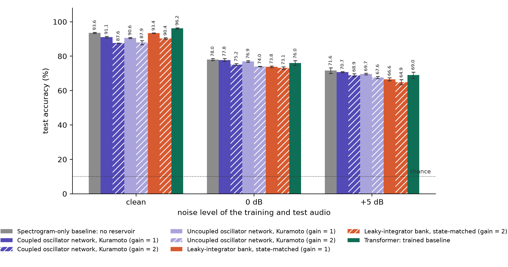
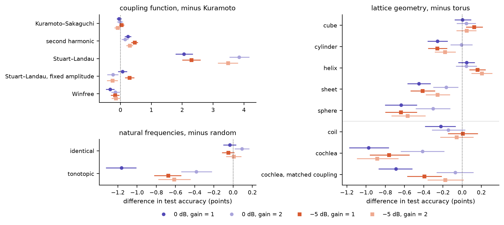

# Spoken-Digit Recognition Without Training: Geometry, Coupling, and Drive Effects in Oscillator Networks

## Abstract

Coupled-oscillator networks are gaining interest as a machine-learning substrate, on the premise that oscillator physics turns signals into useful structure. Yet the ablations that would isolate what the oscillator dynamics contribute are rarely run. We run them for untrained coupled oscillator networks, using spoken-digit classification on AudioMNIST as the measure. A small untrained network is read by a closed-form linear readout and compared with trained conventional networks matched in parameters and with three controls: the same network with its coupling removed, a non-oscillating bank of leaky integrators with the same states and parameters, and the same readout fitted directly to the network's input. Every experimental arm's state is summarized by the same time-pooled statistics and spoken digits classified using the same number of features, so that readout capacity cannot masquerade as dynamics. A sweep then varies the coupling function, lattice geometry, input pathway, readout width and training set size, on digit recognition and on a temporal order task that order-blind readouts cannot solve. The design separates three explanations for an untrained network's accuracy: its input representation, the width of its readout, and the oscillator dynamics and structure itself. Most of the accuracy comes from the input representation and the readout: at a matched width, an untrained Kuramoto network reads within a percentage point of the readout fitted to its input alone in noise, and near chance when the same audio drives it through a quadrature input, though it carries the temporal order that its input cannot. Within the coupling functions, lattice geometry and natural frequencies, a free oscillator amplitude (Stuart–Landau) moved accuracy most, lifting the network above its input and into the range of the trained networks, which otherwise read higher; the lattice geometry, a cochlea-like coil included, moved it by less than a point. These results give studies of trained oscillator networks an untrained baseline to compare against for speech recognition tasks, and insight into which factors contribute to an oscillator network's effectiveness on time series tasks.

## 1 Introduction

Every sense we have transduces a physical signal: light, sound, heat, touch and pressure arrive as waves, and taste and smell as chemistry. If neurons evolved to encode such stimuli, a first-principles reading suggests that models closer to biological computation might be built from the physics of waves and oscillation rather than from statistics alone, and the oscillation and synchronization recorded in neural populations as they track speech ([Assaneo et al. 2020](https://doi.org/10.1038/s41562-020-00962-0); [Doelling et al. 2023](https://doi.org/10.1371/journal.pcbi.1011669); [Pittman-Polletta et al. 2021](https://doi.org/10.1371/journal.pcbi.1008783); [Dogonasheva et al. 2026](https://doi.org/10.1016/j.neunet.2025.108194)) are consistent with neurons acting, in part, as coupled oscillators. We do not test that conjecture here. It motivates a narrower question: where are the useful boundaries of oscillatory neural networks, and what do their dynamics contribute?

A recent survey of oscillator networks in machine learning ([Kryski 2026](https://doi.org/10.2139/ssrn.7445198)) found the ablations that would answer that question largely missing: the coupling term had been removed as a single variable only three times, no study compared coupling functions, no study varied the lattice geometry or its boundaries as a single variable at a matched budget, and none contrasted two ways of injecting the input under controls. We address those gaps on one task, spoken-digit recognition, where automatic speech recognition began ([Davis et al. 1952](https://doi.org/10.1121/1.1906946)) and a standard benchmark for oscillator reservoirs built in hardware ([Torrejon et al. 2017](https://doi.org/10.1038/nature23011); [Shougat et al. 2023](https://doi.org/10.1038/s41598-023-35760-x)). An untrained coupled oscillator network, read by a linear readout, is tested under six coupling functions and eight lattice geometries, among them a coil and a cochlea. We compare these with the readout applied to its input alone, the same uncoupled oscillator network, leaky-integrator banks of the same size, and with five trained networks of the same parameter count. Results on AudioMNIST ([Becker et al. 2024](https://doi.org/10.1016/j.jfranklin.2023.11.038)) are also placed beside the published figures on its own speaker folds. Untrained networks of coupled oscillators have recognized spoken digits before, in simulation and on TI-46 with the same speakers in training and test ([Opala et al. 2019](https://doi.org/10.1103/PhysRevApplied.11.064029); [Coulombe et al. 2017](https://doi.org/10.1371/journal.pone.0178663)). To our knowledge none has been tested on held-out speakers in added noise against its input alone and its own uncoupled form, and we found no AudioMNIST result that combines held-out speakers with added noise; the two studies we found that add noise on AudioMNIST share speakers between training and test ([Beoletto et al. 2026](https://doi.org/10.1002/aisy.202500526); [Young et al. 2026](https://doi.org/10.1186/s13636-026-00457-2)).

## 2 Background

Coupled oscillators are among the most studied systems in physics: populations of them synchronize, form clusters, lock to a drive or split into coherent and incoherent domains, depending on how they are coupled and arranged ([Pikovsky et al. 2001](https://doi.org/10.1017/CBO9780511755743); [Strogatz 2000](https://doi.org/10.1016/S0167-2789%2800%2900094-4); [Kuramoto & Battogtokh 2002](https://arxiv.org/abs/cond-mat/0210694); [Abrams & Strogatz 2004](https://arxiv.org/abs/nlin/0407045)). Machine learning has used them two ways. Untrained, as reservoirs read by a trained linear readout ([Jaeger 2001](https://www.ai.rug.nl/minds/uploads/EchoStatesTechRep.pdf); [Maass et al. 2002](https://doi.org/10.1162/089976602760407955); [Tanaka et al. 2019](https://doi.org/10.1016/j.neunet.2019.03.005)): a spintronic oscillator recognized spoken digits in hardware ([Torrejon et al. 2017](https://doi.org/10.1038/nature23011)), though much of that accuracy came from its cochlear front end ([Abreu Araujo et al. 2020](https://doi.org/10.1038/s41598-019-56991-x)), whose authors therefore report a reservoir's gain over its front end alone, and test it on held-out speakers in noise on another corpus. On AudioMNIST, a simulated network of 128 coupled protonic nickelate devices, a neuromorphic hardware element that does not oscillate, reached 95.3% on 3,000 clips, above the same network uncoupled and above a readout of the unprocessed input, the controls used here ([Zhou et al. 2026](https://doi.org/10.1038/s41565-026-02133-0)). Spiking reservoirs, whose liquid of neurons is shaped by unsupervised plasticity rather than left untrained, recognize TI-46 digits better as they grow, from 77.7% with 800 neurons to 86.7% with 3,200, on the digits of 16 speakers ([Srinivasan et al. 2018](https://doi.org/10.3389/fnins.2018.00524)). Trained, as layers whose coupling or frequencies are learned: coupled oscillatory recurrent networks ([Rusch & Mishra 2021](https://openreview.net/forum?id=F3s69XzWOia)), one of which reached 89% on AudioMNIST from the raw waveform with a random, not speaker-disjoint, split ([Chandravadia & Imam 2026](https://doi.org/10.1016/j.patter.2026.101563)), Neural Wave Machines on an oscillator lattice ([Keller & Welling 2023](https://proceedings.mlr.press/v202/keller23a.html)), AKOrN ([Miyato et al. 2025](https://openreview.net/forum?id=nwDRD4AMoN)), WONN ([Dai & Song 2026](https://arxiv.org/abs/2605.20922)), FSN ([Nunley 2026](https://arxiv.org/abs/2606.18694)) and Un-0 ([unconv.ai 2026](https://unconv.ai/blog/introducing-un-0-generating-images-with-coupled-oscillators/)) among them. Each adopts one coupling function and one arrangement, and a recent survey found no benchmark any two share ([Kryski 2026](https://doi.org/10.2139/ssrn.7445198)). Here a single task is held fixed and the coupling function, the geometry and the input are varied across it, on untrained networks, so that each can be compared with controls before any training enters.

### 2.1 Coupling functions

Each oscillator's phase θᵢ evolves as θ̇ᵢ = ωᵢ + couplingᵢ + g·uᵢ − λ sin θᵢ: its natural frequency, the coupling from the other oscillators of its channel, the input and a restoring pull toward phase 0. The six coupling functions differ only in the coupling term. Four are phase models that machine-learning systems have built on or that physics offers as controlled departures from Kuramoto's; two are Stuart–Landau amplitude-phase oscillators, with and without their amplitude. A recent survey found no oscillator machine learning study compares coupling functions as direct controls, so the choice of one over another "remains a convention rather than a finding" ([Kryski 2026](https://doi.org/10.2139/ssrn.7445198)). **Appendix D** illustrates how each pushes an oscillator.

| coupling function | coupling term | what it adds | in machine learning |
|---|---|---|---|
| **Kuramoto** | Σⱼ Kᵢⱼ sin(θⱼ − θᵢ) | pulls each oscillator toward the others' phases: the minimal model of synchronization ([Kuramoto 1975](https://doi.org/10.1007/BFb0013365)), and the reference | trained all-to-all in Un-0 ([unconv.ai 2026](https://unconv.ai/blog/introducing-un-0-generating-images-with-coupled-oscillators/)); a D-dimensional generalization in AKOrN ([Miyato et al. 2025](https://openreview.net/forum?id=nwDRD4AMoN)) |
| **Kuramoto–Sakaguchi** | Σⱼ Kᵢⱼ sin(θⱼ − θᵢ − α), α = π/4 | a phase lag that breaks the pull's symmetry and admits partial coherence ([Sakaguchi & Kuramoto 1986](https://doi.org/10.1143/PTP.76.576); [Abrams & Strogatz 2004](https://arxiv.org/abs/nlin/0407045)) | with Daido harmonics and a delay in FSN ([Nunley 2026](https://arxiv.org/abs/2606.18694)) |
| **Second harmonic** | Kuramoto plus β Σⱼ Kᵢⱼ sin 2(θⱼ − θᵢ), β = 0.5 | favours two-cluster states, pairs in phase or in opposition ([Daido 1992](https://doi.org/10.1143/ptp/88.6.1213); [Hansel et al. 1993](https://doi.org/10.1103/PhysRevE.48.3470)) | none recorded |
| **Winfree** | −sin θᵢ Σⱼ Kᵢⱼ (1 + cos θⱼ) | separates an oscillator's sensitivity, set by its own phase, from its influence, set by its neighbour's ([Winfree 1967](https://doi.org/10.1016/0022-5193%2867%2990051-3)) | generalized, with attention-defined coupling, in WONN ([Dai & Song 2026](https://arxiv.org/abs/2605.20922)) |
| **Stuart–Landau** | Σⱼ Kᵢⱼ (zⱼ − zᵢ), z = x + iy | amplitude as well as phase: each oscillator relaxes to a cycle of unit radius ([Stuart 1960](https://doi.org/10.1017/S002211206000116X); [Aranson & Kramer 2002](https://doi.org/10.1103/RevModPhys.74.99)) | one graph network |
| **Stuart–Landau, fixed amplitude** | the same, amplitude held at 1 | the phase-only limit, which reduces to Kuramoto: separates what the amplitude adds | none recorded |

Table: The six coupling functions. Kᵢⱼ is the kernel weight between oscillators i and j, positive or negative, and each term is summed over the other oscillators of the channel. Machine-learning uses are those recorded by the survey of [Kryski 2026](https://doi.org/10.2139/ssrn.7445198).

### 2.2 Lattice geometries

In our experiment, every channel stores its 256 oscillators as a 16 × 16 grid whose row r is driven by mel band r. A lattice geometry changes only which oscillators are neighbours, that is, how the grid's edges are glued; each of a network's four channels is a separate copy of the same shape, and the kernel, the parameters and the oscillators are the same under every geometry, so a comparison between geometries varies one thing.

| Geometry | How the grid is shaped |
|---|---|
| **Torus** | Both axes wrap: the top row is coupled to the bottom, and the left column to the right. The reference geometry. |
| **Cylinder** | Columns wrap, rows do not: the frequency axis is open, as in the cochlea, so the highest band is not coupled around to the lowest. |
| **Sheet** | Neither axis wraps, and coupling stops at every edge. With the cylinder and the torus it varies the number of wrapped axes from zero to two. |
| **Helix** | The 256 sites read as one closed ring, one octave (64 sites, four rows) per turn, so an offset of one turn joins bands an octave apart. |
| **Cube** | Each row's 16 columns read as a 4 × 4 slab, giving a 16 × 4 × 4 lattice that wraps on all three axes: the same oscillators, with shorter paths between them. |
| **Sphere** | Rows as latitudes with open poles and columns as longitudes that wrap, each oscillator's influence weighted by the cosine of its latitude: an approximation to a sphere, not exact spherical coupling. |
| **Coil** | The 256 sites read as one open line from the base (highest band) to the apex (lowest band), one octave per turn: the helix with its ends apart, as the cochlea's spiral is open at both ends, so an offset of one turn joins sites that sit side by side on adjacent turns. |
| **Cochlea** | The coil with two features of the cochlea's mechanics: influence runs three times as strongly from base to apex as back, as the travelling wave does, and the coupling into each site grows with the coil's curvature, from a quarter at the base to full strength at the apex, as the spiral tightens. A control keeps both at the coil's average coupling. |

Table: The eight lattice geometries. The first six run in the design experiment; the coil and the cochlea in the cochlea experiment (Appendix B).

The first six vary the number of wrapped axes (sheet, cylinder, torus), the dimension (the cube, which shortens the paths between oscillators) and how frequency is laid out: the cylinder and the sphere leave the frequency axis open, as the cochlea does, and the helix puts bands an octave apart next to each other, as the pitch helix of music perception does ([Shepard 1982](https://doi.org/10.1037/0033-295X.89.4.305)). The helix is not a cochlea: it is closed, and nothing in it runs one way. The coil and the cochlea follow the cochlea itself, whose coiled, tonotopic shape a spiral metamaterial resonator has used to classify AudioMNIST digits ([Beoletto et al. 2026](https://doi.org/10.1002/aisy.202500526)); with tonotopic natural frequencies, each coil position's frequency falls exponentially from base to apex, as along the basilar membrane. Oscillator lattices are a long-studied setting in physics ([Sakaguchi et al. 1987](https://doi.org/10.1143/PTP.77.1005)), and machine-learning systems couple oscillators all-to-all ([unconv.ai 2026](https://unconv.ai/blog/introducing-un-0-generating-images-with-coupled-oscillators/)), through attention, or locally on a lattice ([Keller & Welling 2023](https://proceedings.mlr.press/v202/keller23a.html); [Miyato et al. 2025](https://openreview.net/forum?id=nwDRD4AMoN)). Geometry has been varied in four of the systems the survey covers, "and in none of them as a single variable", and it found no work that varies coupling range or boundary conditions at a matched budget ([Kryski 2026](https://doi.org/10.2139/ssrn.7445198)).

![Lattice geometries. Every channel stores its 256 oscillators the same way, as a 16 × 16 grid whose row r is driven by mel band r (colour, lowest band dark). A geometry changes only which oscillators are neighbours, that is, how the grid's edges are glued, and each of a network's four channels is a separate copy of the same shape. For each geometry, left: the grid, with glued edges marked by a shared colour and arrow, open edges dark, one oscillator (star) and its nearest neighbours (dots); right: the shape the gluing makes, with the same oscillator and neighbours. On the torus the highest band's row meets the lowest; on the cylinder and the sphere the frequency axis is open; the helix threads all 256 sites into one closed ring, one octave per turn; the cube folds each row into a 4 × 4 slab and wraps all three axes; the coil threads the same sites into one open line, apex (lowest band) at the centre and base outside, and the cochlea adds the base-to-apex direction (arrows) and coupling that grows with curvature toward the apex (a thicker line).](resources/figures/a2-lattice-geometries.png)

## 3 Methods

### 3.1 Experimental design

Our study asks six questions:

1. Does an untrained coupled oscillator network carry information for recognizing spoken digits beyond its input alone, beyond a non-oscillating memory of the same size, and beyond the same oscillators uncoupled?
2. How do trained networks of the same parameter count compare?
3. Do the coupling function, the lattice geometry, the natural frequencies, the restoring strength and the coupling ceiling change the answer?
4. Does the way the audio enters the network matter?
5. How do the answers change with the readout's width and the amount of training data?
6. Does the network carry the order of events, on a task its input's summary statistics cannot solve?

The code and every run's record are in the supplementary material.

It ran as eight experiments of 6,275 runs in all (Appendix B). Every run is one arm, one of the systems compared, at one noise level, input gain and random seed; every oscillator network is 4 channels of a 16 × 16 lattice. Each arm's signals are summarized, brought to a common width and classified by the same linear readout (Section 3.4), each condition is run at three seeds, and every accuracy is measured on speakers held out from training (Section 3.2). The runs used an Apple M1 Max (10 cores, 64 GB). The leak check and the controls and design experiments ran on its CPU; in the other five the reservoirs were simulated on its GPU, while the readout and the trained baselines stayed on the CPU. The two devices round differently: rerun on the GPU, the controls experiment's reservoir runs reproduced 1,262 of their 1,296 recorded cells exactly and all but one within two test clips, and in the last the readout chose a different penalty and read 0.63 points lower. Appendix A defines every term.

### 3.2 Task and data

AudioMNIST ([Becker et al. 2024](https://doi.org/10.1016/j.jfranklin.2023.11.038)) holds 30,000 recordings of the ten spoken digits by 60 speakers, 50 of each digit per speaker. Each recording is resampled from 48 kHz to 16 kHz, peak-normalized, trimmed of leading and trailing silence below 1% of its peak, and capped at 1 s. We use it rather than TI-46, the corpus of the oscillator hardware result, because it is open, has four times as many speakers, and has published speaker-disjoint folds.

Every result keeps speakers apart, so the accuracy measures recognition of voices the readout has never heard; a split that spreads each speaker across training and test would let it learn the speakers too. Under Protocol A, the arms are trained on speakers 1 to 48 (24,000 recordings) and tested on all 6,000 recordings of speakers 49 to 60, an 80/20 split by speaker. A seed fixes a permutation of the training recordings, and its training set is the first 2,048 of them (8,192 and 24,000 for the training-size comparison), so a larger set contains the smaller. Under Protocol B, used only to place results beside published ones, the arms follow the five folds of [Becker et al. 2024](https://doi.org/10.1016/j.jfranklin.2023.11.038): each fold splits the 60 speakers into 36 for training, 12 for validation and 12 for testing (18,000, 6,000 and 6,000 recordings, a 60/20/20 split by speaker), and every speaker is tested in exactly one fold, so a fold plays the part a seed plays under Protocol A.

The order task tests whether an arm carries the order of events. Two digits of a pair (0 and 6, 1 and 8, 2 and 5, 3 and 7, 4 and 9) are spoken one after the other, and the arm must say which came first; each pair has 2,048 training sequences from the training speakers and 2,048 test sequences from the test speakers, balanced between the two orders. The summary statistics of an input read over the whole span do not depend on the order of its frames, so the spectrogram-only baseline reads chance, 50%, and anything above it must come from the arm's own dynamics.

### 3.3 Front end: the mel spectrogram

Every experimental arm hears the audio through the same fixed front end: a log-mel spectrogram of 16 mel bands, computed with a 512-point Fourier transform every 256 samples (16 ms, 62.5 frames per second) and rescaled by a fixed affine map, with nothing learned and no per-utterance normalization. We chose a fixed, basic front end over a learned one ([Zeghidour et al. 2021](https://openreview.net/forum?id=jM76BCb6F9m); [Lostanlen et al. 2023](https://arxiv.org/abs/2307.13821)) so that nothing trained sits before the arms being compared. A learned front end would be fitted differently for each arm, a difference in accuracy could come from it rather than from what follows, and it would favour the trained baselines, which can adapt to a richer input, over the untrained reservoirs, which cannot. Sixteen bands also fit every arm at once: mel band r drives row r of each of the lattice's 16 rows, and every trained baseline takes the same 16 signals as its input. The choice of front end matters on this corpus: on 3,000 AudioMNIST clips from six speakers, shared between training and test, a linear classifier reads 98.7% from the tonogram of a passive cochlea-shaped metamaterial resonator, 98.6% from MFCCs and 98.4% from a cochleagram, but 75.5% from a linear spectrogram ([Beoletto et al. 2026](https://doi.org/10.1002/aisy.202500526)).

### 3.4 Readout

Every arm is read the same way. Each of its signals (a band energy, the sine or cosine of an oscillator's phase, a leaky integrator's state, or a trained baseline's hidden unit) is summarized by three statistics, its mean, its standard deviation and its mean absolute change from frame to frame, over each of four equal windows of the same frames for every clip: frames 16 to 61, after a 16-frame warm-up, and frames 16 to 147 as one window for the order task. The arms expose very different numbers of signals, from 16 band energies to 2,048 oscillator signals, so their summaries range from 192 to 24,576 numbers. So that readout capacity cannot pass for dynamics, every arm is brought to the same width: its summaries are standardized with the training set's own statistics and multiplied by a random Gaussian matrix to 192 features (and to 1,024 and 4,096 in the width comparison), a projection that approximately preserves distances between feature vectors ([Johnson & Lindenstrauss 1984](https://doi.org/10.1090/conm/026/737400)). The spectrogram-only baseline and four of the trained baselines are 192 wide and are not projected; the GRU's 216 features are.

A single linear layer then maps the 192 features to ten digit scores. It is fitted by ridge regression, least squares with an L2 penalty solved in closed form, with the penalty chosen from four values on the last eighth of the training clips. We use this readout, the reservoir-computing standard ([Jaeger 2001](https://www.ai.rug.nl/minds/uploads/EchoStatesTechRep.pdf); [Lukoševičius 2012](https://doi.org/10.1007/978-3-642-35289-8_36)), rather than a learned decoder because it is the weakest reader that can be fitted identically for every arm: whatever it separates must already be in the features. The trained baselines are trained end to end through a learned linear layer on the same statistics, standardized as the readout standardizes them, and then read by the same readout.

The projection matrix is fixed, one draw used for every run, or seeded, a draw of its own for each run seed. Every result is reported under the fixed projection. Because a single draw leaves the projection's own variability out of the spread over seeds, the controls experiment's reservoirs are also read under the seeded projection, and both are reported.

### 3.5 Input pathways

The survey found no study that contrasts two ways of injecting the input under controls ([Kryski 2026](https://doi.org/10.2139/ssrn.7445198)), so the audio drives a reservoir in one of two ways, the second adding one kind of information to the first. **Spectrogram**: each band energy of the mel spectrogram adds to the rotation rate of the oscillators in its row, θ̇ᵢ += g·Aᵣ(t), the standard reservoir input; every experiment uses it unless stated otherwise. **Quadrature**: each band's energy together with the phase of its signal relative to the band's centre frequency, entering as a phase-referenced push g·Aᵣ sin(φᵣ − θᵢ), the injection form of [Adler 1946](https://doi.org/10.1109/JRPROC.1946.229930), so an oscillator can lock to the band's own cycle. Each pathway's spectrogram-only baseline reads that pathway's own front end. Driving the oscillators with each band's waveform itself, at the full 16 kHz, as a physical oscillator array would be driven, is left to a companion study.

### 3.6 Noise protocol

White noise is added to every clip, in training and in test alike, at a level set by the clip's own speech and given as the signal-to-noise ratio: at 0 dB the noise is as loud as the speech, and at −5 dB it is 5 dB louder. These are the two signal-to-noise ratios at which [Young et al. 2026](https://doi.org/10.1186/s13636-026-00457-2) trained hybrid real- and complex-valued convolutional networks on AudioMNIST, testing them from −10 to +10 dB, though on a random split of the clips rather than one by speaker. Each clip's noise is drawn from a generator seeded by the clip's identity, so every arm hears exactly the same noisy clip, and clean audio is also reported. We add noise because the clean task nearly saturates: on clean audio the spectrogram-only baseline reads 93.6% and the coupled oscillator network 91.1% (gain 1, 2,048 training clips), leaving little room to tell designs apart. The two levels were set before the runs to put the strongest untrained arm between 70% and 90%, and they do: the coupled oscillator network reads 77.8% at 0 dB and 70.7% at −5 dB (gain 1). Two levels keep the design affordable while showing whether an effect holds as the noise grows.

### 3.7 Input gain and the integrator-validity bound

Input gain is the factor that scales the mel spectrogram before it drives a reservoir. It applies only to the reservoirs: the coupled and uncoupled oscillator networks and the leaky-integrator banks. Both of these types of reservoirs are nonlinear, so the strength of the input relative to their own dynamics changes how they respond. For an oscillator, the input competes with its natural frequency, its coupling and the restoring pull; for a leaky integrator, it sets how far into the saturating _tanh_ the input reaches. How hard the input pushes, relative to a reservoir's own dynamics, therefore sets how much of the input its state carries: a weak push barely perturbs the oscillators' own rotation, and a strong one makes them follow the input.

The reservoirs are run at gains 1 and 2. At gain 1 the band energies, rescaled to lie roughly between 0 and 2, push with the same magnitude as the natural frequencies (about 1) and more than the restoring strength (0.3 or 0.1); gain 2 doubles that push. The two values are fixed in advance rather than tuned, and both are reported: gain 2 reads lower than gain 1 for every reservoir at every noise level, by 0.7 to 3.5 points at 2,048 training clips, and a sweep to gain 12 (Section 4.4) shows how far each coupling function tolerates a stronger push. The gain is positive because the input is an energy: a negative gain would make louder sound slow the oscillators rather than speed them, a different model rather than a different strength. It is bounded above by the integrator: the network advances in time steps of 0.1, and the phase an oscillator gains from the input in one step must stay below π for the step to be valid ([Hairer et al. 1993](https://doi.org/10.1007/978-3-540-78862-1)), a bound the spectrogram pathway reaches near gain 17.

The spectrogram-only baseline has no dynamics for gain to act on. Its features are summary statistics of the band energies, and each scales in proportion to the input: doubling the input doubles every mean, standard deviation and mean absolute change, and the readout's standardization divides that factor out exactly, so the baseline at gain 2 would be identical to the baseline at gain 1. The trained baselines learn their own input scale: a fixed gain could be undone by the first layer's weights, so it would relabel the same experiment rather than define a new one. Each trained baseline is therefore trained once per noise level, on the input as it is.

### 3.8 Reporting and uncertainty

No threshold decides a result. Every accuracy is reported as its mean over replicates, with the sample standard deviation and each replicate's value. A replicate is one seed under Protocol A, which sets the arm's random parameters and which training clips it draws, and one fold under Protocol B (Section 3.2). Every comparison between two arms, for example the coupled oscillator network against the spectrogram-only baseline, is paired: both are scored on the same test clips, at the same noise level, gain and seed. It is reported as the mean difference in accuracy, the standard deviation of that difference over seeds, and a 95% interval from a paired bootstrap: the test clips are resampled with replacement 2,000 times, the difference is recomputed on each resample, and the interval holds the middle 95% of those differences.

These measure different sources of variation. The standard deviation over seeds is how much a result moves when the random draws and the training clips change; the bootstrap interval is how precisely the fixed test set measures a difference. Scoring both arms on the same clips cancels the clips every arm finds easy or hard, so the paired interval is narrower than one for two unpaired accuracies, but it covers test-set sampling only. Neither covers the fixed projection's own draw, which is why the controls experiment's reservoirs are also read under the seeded projection (Section 3.4). The primary cell for every comparison is width 192, 2,048 training clips and the four-window read (the whole-span read for the order task).

## 4 Results

### 4.1 The network against its controls

Every coupled and uncoupled oscillator network in this section, and in Sections 4.2, 4.6 and 4.7, is the reference configuration: Kuramoto coupling on the torus, with random natural frequencies, restoring strength 0.3 and coupling ceiling 1; the other coupling functions, among them Stuart–Landau, are compared in Section 4.3. The table gives recognition accuracy at the primary cell for the spectrogram-only baseline, the three reservoirs at input gain 1, and the GRU, the trained baseline with the highest accuracy with noise; the figure adds each reservoir at gain 2.

| arm | clean | 0 dB | −5 dB |
|---|---|---|---|
| **Spectrogram-only baseline**: the readout reads the 16 mel band energies directly; no reservoir | 93.6 ± 0.3 | 78.0 ± 0.6 | 71.6 ± 1.6 |
| **Coupled oscillator network** (gain = 1): 1,024 Kuramoto oscillators, untrained | 91.1 ± 0.4 | 77.8 ± 0.8 | 70.7 ± 0.3 |
| **Uncoupled oscillator network** (gain = 1): the same network with its coupling removed | 90.6 ± 0.3 | 76.9 ± 0.5 | 69.7 ± 0.4 |
| **Leaky-integrator bank, state-matched** (gain = 1): 1,024 leaky integrators with the network's states and parameters, untrained | 93.4 ± 0.2 | 73.8 ± 0.5 | 66.6 ± 0.8 |
| **GRU**: a trained baseline, 1,944 parameters, trained end to end | 96.5 ± 0.3 | 82.8 ± 1.3 | 76.9 ± 1.6 |

Table: Single spoken-digit recognition accuracy (%) on AudioMNIST, mean ± standard deviation over three seeds.

### 4.2 Trained baselines

The five trained baselines, each trained end to end on the same clips and read by the same readout, reached the accuracies below at the primary cell. With noise the GRU and TCN read highest, 82.8% and 82.6% at 0 dB, and every trained baseline read above the Kuramoto network and the whole-clip spectrogram-only baseline there. Every recognition run trained, cutting its loss by more than 20%. With 24,000 training clips at 0 dB, the transformer reached 90.6%, the GRU 89.9%, the TCN 89.7%, the S4D 88.5% and the CNN 86.7%; the S4D is a diagonal state-space model, a family that compares well with other architectures on time-series classification, audio included ([Saadatmand et al. 2026](https://arxiv.org/abs/2605.27406)).

| trained baseline | parameters | clean | 0 dB | −5 dB | failed runs with noise |
|---|---|---|---|---|---|
| GRU | 1,944 | 96.5 ± 0.3 | 82.8 ± 1.3 | 76.9 ± 1.6 | 0 of 18 |
| TCN | 1,972 | 97.0 ± 0.7 | 82.6 ± 1.3 | 76.2 ± 0.4 | 0 of 18 |
| CNN | 2,109 | 94.7 ± 0.6 | 79.2 ± 2.0 | 73.9 ± 1.6 | 0 of 18 |
| transformer | 1,968 | 96.3 ± 0.7 | 79.8 ± 0.6 | 72.3 ± 0.4 | 0 of 18 |
| S4D | 1,840 | 93.2 ± 0.6 | 78.5 ± 0.5 | 74.2 ± 0.6 | 0 of 18 |

Table: The trained baselines: parameters, recognition accuracy (%) at the primary cell as mean ± standard deviation over three seeds, and runs with added noise, over all three training sizes, whose training failed (loss cut by less than 20%).

On the five speaker folds of [Becker et al. 2024](https://doi.org/10.1016/j.jfranklin.2023.11.038) (clean audio, 18,000 training clips, one run per fold), at width 192, the whole-clip spectrogram-only baseline read 96.0 ± 1.7%, the coupled oscillator network 91.9 ± 3.1% at gain 1 and 88.9 ± 3.1% at gain 2, the uncoupled network 92.3 ± 2.7%, and the state-matched leaky-integrator bank 93.9 ± 1.8% (gain 1). The trained baselines read 97.0% (CNN) to 98.4% (transformer). Read at width 4,096, the coupled network reached 96.9 ± 1.3% and the state-matched bank 96.8 ± 1.1% (gain 1). On the same folds Becker et al. report 95.82 ± 1.49% for AlexNet on spectrograms and 92.53 ± 2.04% for their AudioNet on the raw waveform.

### 4.3 Network design: coupling function, lattice geometry and natural frequencies

The design experiment varies the coupled oscillator network one factor at a time around the reference configuration (Kuramoto coupling, torus, random natural frequencies, restoring strength 0.3, coupling ceiling 1): six coupling functions, six lattice geometries and three kinds of natural frequencies, crossed with two restoring strengths and two coupling ceilings (Section 4.4). The two Stuart–Landau functions run on the torus only, so there are 312 configurations, each at 0 and −5 dB, gains 1 and 2 and three seeds, read at the primary cell. A level's difference from its reference is paired over every configuration that matches it in the other four factors, on the same test clips and seeds: 72 configurations for each phase coupling function, 12 for each Stuart–Landau function, 48 for each geometry and 104 for each kind of natural frequencies.

Across the 312 configurations, accuracy at gain 1 ran from 75.2% to 80.3% at 0 dB (median 77.4%) and from 68.3% to 73.0% at −5 dB (median 70.0%); the reference configuration read 77.8% and 70.7%. At gain 2 the ranges were 73.6% to 80.1% (median 74.8%) and 66.5% to 73.0% (median 68.3%).

The Stuart–Landau network, whose oscillators have a free amplitude, read 2.1 to 3.8 points above its Kuramoto match, the largest difference in the experiment. At gain 2 its twelve configurations were the twelve highest of the 312 at both noise levels; at gain 1 they ran from 78.1% to 80.3% at 0 dB, against 78.7% for the best phase-oscillator configuration. At the reference configuration it read above the whole-clip spectrogram-only baseline in all four conditions: by 2.31 points [1.63, 3.01] at 0 dB and 1.36 [0.62, 2.11] at −5 dB at gain 1, and by 1.14 [0.46, 1.88] and 1.38 [0.63, 2.16] at gain 2. With its amplitude fixed, the same network read within 0.3 points of Kuramoto. The other phase coupling functions differed from Kuramoto by at most 0.46 points: second harmonic above it by 0.15 to 0.46, Winfree below it by 0.15 to 0.34, and Kuramoto–Sakaguchi within 0.1.

Every lattice geometry read within 0.65 points of the torus. The sphere read lowest (0.30 to 0.64 points below), then the sheet (0.17 to 0.45 below) and the cylinder (0.01 to 0.26 below); the cube and the helix read within 0.21 points of the torus. Tonotopic natural frequencies read 0.38 to 1.16 points below random ones, and identical frequencies within 0.1 points of random ones.

The coil and the cochlea (Section 2.2) ran for the four phase coupling functions and the three kinds of natural frequencies, and pair with the design experiment's torus and helix over those twelve configurations. The coil read within 0.22 points of the torus, and 0.10 to 0.28 points below the helix, the same line closed into a ring. The cochlea read 0.41 to 0.97 points below the torus and 0.27 to 0.83 points below the coil: 75.5% to 77.6% at 0 dB and gain 1 across its twelve configurations, against 77.8% for the torus reference, and 76.0% with Kuramoto coupling and tonotopic frequencies, its most cochlea-like configuration. Its curvature weighting also lowers its average coupling to 0.54 of the coil's, because the ceiling caps the coupling where it is strongest, at the apex, and its drop below the coil is the size of halving the coupling ceiling in the design experiment (0.39 to 0.68 points). A control with the cochlea's direction and shape of weighting at the coil's average coupling, run on the same twelve configurations, recovered 0.28 to 0.71 points of that drop, yet still read 0.40 to 0.47 points below the coil at gain 1 and within 0.12 points of it at gain 2.

| level minus reference | 0 dB, gain = 1 | 0 dB, gain = 2 | −5 dB, gain = 1 | −5 dB, gain = 2 |
|------------------|-------------|-------------|-------------|-------------|
| Kuramoto–Sakaguchi minus Kuramoto | −0.05 ± 0.23 | −0.01 ± 0.25 | +0.04 ± 0.07 | −0.09 ± 0.09 |
| second harmonic minus Kuramoto | +0.24 ± 0.09 | +0.15 ± 0.20 | +0.46 ± 0.21 | +0.30 ± 0.06 |
| Stuart–Landau minus Kuramoto | +2.06 ± 0.26 | +3.84 ± 0.32 | +2.30 ± 0.18 | +3.48 ± 0.12 |
| Stuart–Landau, fixed amplitude minus Kuramoto | +0.07 ± 0.12 | −0.24 ± 0.07 | +0.30 ± 0.23 | −0.26 ± 0.33 |
| Winfree minus Kuramoto | −0.34 ± 0.06 | −0.16 ± 0.14 | −0.17 ± 0.09 | −0.15 ± 0.09 |
| cube minus torus | +0.00 ± 0.30 | +0.04 ± 0.21 | +0.12 ± 0.10 | +0.05 ± 0.08 |
| cylinder minus torus | −0.26 ± 0.04 | −0.01 ± 0.13 | −0.26 ± 0.16 | −0.18 ± 0.10 |
| helix minus torus | +0.05 ± 0.13 | +0.04 ± 0.22 | +0.16 ± 0.17 | +0.21 ± 0.10 |
| sheet minus torus | −0.45 ± 0.32 | −0.17 ± 0.22 | −0.41 ± 0.14 | −0.26 ± 0.06 |
| sphere minus torus | −0.64 ± 0.15 | −0.30 ± 0.28 | −0.64 ± 0.26 | −0.57 ± 0.04 |
| identical minus random ω | −0.04 ± 0.05 | +0.09 ± 0.05 | −0.05 ± 0.17 | +0.01 ± 0.14 |
| tonotopic minus random ω | −1.16 ± 0.34 | −0.38 ± 0.09 | −0.68 ± 0.34 | −0.61 ± 0.11 |
| λ 0.1 minus 0.3 | −0.16 ± 0.09 | −0.13 ± 0.08 | −0.14 ± 0.09 | −0.23 ± 0.01 |
| ceiling 0.5 minus 1 | −0.59 ± 0.12 | −0.39 ± 0.08 | −0.68 ± 0.15 | −0.56 ± 0.08 |
| coil minus torus | −0.22 ± 0.31 | −0.15 ± 0.25 | +0.01 ± 0.48 | −0.06 ± 0.27 |
| cochlea minus torus | −0.97 ± 0.06 | −0.41 ± 0.11 | −0.76 ± 0.53 | −0.89 ± 0.20 |
| cochlea minus coil | −0.75 ± 0.26 | −0.27 ± 0.36 | −0.77 ± 0.21 | −0.83 ± 0.07 |
| coil minus helix | −0.28 ± 0.30 | −0.10 ± 0.13 | −0.17 ± 0.20 | −0.24 ± 0.11 |
| cochlea at the coil's coupling minus coil | −0.47 ± 0.38 | +0.07 ± 0.36 | −0.40 ± 0.35 | −0.12 ± 0.34 |
| cochlea minus cochlea at the coil's coupling | −0.28 ± 0.12 | −0.34 ± 0.16 | −0.37 ± 0.47 | −0.71 ± 0.32 |

Table: Each design level minus its reference level, over matched configurations: difference in recognition accuracy (points), mean ± standard deviation over three seeds; ω, natural frequencies; λ, restoring strength; ceiling, coupling ceiling. The coil and cochlea rows pair the four phase coupling functions and three kinds of natural frequencies at the reference restoring strength and ceiling. The 95% paired intervals for the design experiment's rows are in the figure.

### 4.4 Sensitivity of the canonical physics values

The restoring strength and the coupling ceiling are crossed with every other factor in the design experiment, so each difference is paired over 156 configurations. A restoring strength of 0.1 read 0.13 to 0.23 points below 0.3, and a coupling ceiling of 0.5 read 0.39 to 0.68 points below 1, in all four conditions (the last two rows of the table in Section 4.3).

Adding each oscillator's rotation rates to the read raised accuracy by 0.13 to 0.17 points at gain 1 and by 0.47 to 0.49 points at gain 2, averaged over all 312 configurations. Per-clip correctness is kept only for the primary read in the design experiment, so this difference has no bootstrap interval.

A sweep extends the restoring strength, the coupling ceiling and the gain beyond the design experiment's levels, for every coupling function at the reference configuration, paired with the design experiment's reference cells on the same clips and seeds (the sweep's reservoirs ran on the Apple GPU and the design experiment's on its CPU, which agree within two test clips in all but one of 1,296 recorded cells; Section 3.1). Restoring strengths of 0.5, 0.8 and 1.0 moved the phase-oscillator networks by −1.2 to +2.1 points against 0.3, with Kuramoto 0.2 to 0.8 points above; they lowered the Stuart–Landau network in every condition, by 0.4 to 2.8 points, more as the restoring strength grew. Coupling ceilings of 1.5 and 2 moved every coupling function by −2.4 to +1.7 points against 1, with no direction common to them.

Gain separates the Stuart–Landau network from the rest. From gain 1 to gain 8 it lost 4.3 points at 0 dB and 2.8 at −5 dB, while every phase-oscillator network lost 15 to 19 points and the Stuart–Landau network with its amplitude fixed 25 to 28. Beyond gain 8 it also gave way, losing 8.4 points by gain 10 and 20.8 by gain 12 at 0 dB (7.0 and 19.4 at −5 dB), against 24 to 38 points for the others.

### 4.5 Alternative input format: quadrature

Rather than just test a mel spectrogram front-end drive we wanted to see what a quadrature format would produce. The quadrature experiment ran ten coupled oscillator networks on the quadrature pathway: the four phase coupling functions on the torus and Kuramoto on the helix, each with random and tonotopic natural frequencies. They read 11.7% to 15.1% at gain 1 and 12.2% to 14.3% at gain 2, against a chance level of 10%. The spectrogram-only baseline read on the quadrature front end reached 36.1% at 0 dB and 28.2% at −5 dB over the whole clip, and 26.9% and 21.7% from frame 16. On the same clips and seeds, each network read 55.7 to 66.0 points below the same network driven through the spectrogram pathway. Within any one noise level and gain, the ten networks spanned at most 2.5 points, and Winfree with tonotopic frequencies read highest in three of the four conditions. The oscillators did not lock to the quadrature drive: their mean phase-locking value to their own band's drive ranged from 0.16 to 0.21 across runs, and in no run did more than 0.3% of them lock above 0.5.

### 4.6 Readout sufficiency: width and training size

Widening the readout from 192 to 4,096 features, at 2,048 training clips, raised the coupled oscillator network's recognition accuracy by 2.1 to 3.8 points at gain 1 and 2.8 to 6.3 points at gain 2, the uncoupled network's by 0.3 to 2.4 and 1.3 to 4.0 points, and the leaky-integrator banks' by 1.3 to 1.8 points on clean audio at gain 1, 2.9 to 3.9 points at gain 2, and 5.0 to 6.2 points with noise. The spectrogram-only baseline and four of the trained baselines are 192 wide, so a wider read leaves them unchanged; the GRU, 216 wide, gained 0.3 to 1.2 points.

At width 192, going from 2,048 to 24,000 training clips raised the whole-clip baseline by 4.1 points at 0 dB and 3.5 points at −5 dB, and the coupled network by 2.0 points at both; the trained baselines gained 7.1 to 10.8 points at 0 dB and 7.5 to 12.4 at −5 dB, the transformer most. With 24,000 clips and width 4,096, the coupled network read 85.9% at 0 dB and 78.3% at −5 dB, the state-matched bank 84.8% and 78.6%, and the whole-clip baseline 82.1% and 75.1%, against 86.7% to 90.6% at 0 dB and 81.4% to 84.9% at −5 dB for the trained baselines.

Read through a projection drawn for each run seed instead of the one fixed draw, the controls experiment's reservoirs moved by −1.29 to +0.88 points on recognition and −0.63 to +1.22 points on order (seeded minus fixed, 48 paired comparisons, 35 of whose 95% intervals contain zero). Under the seeded projection the coupled network read 2.27, 0.40 and 0.69 points below the whole-clip baseline on recognition at gain 1 (clean, 0 dB, −5 dB), against 2.53, 0.23 and 0.88 under the fixed one; 0.58 to 1.46 points above the uncoupled network (0.43 to 1.08 fixed); and 4.0 to 4.8 points above the state-matched bank with noise (4.0 to 4.2 fixed).

<!-- TODO: Coherence: every network run in the Becker folds and later experiments records the order parameter R, phase locking to each band's drive, the share of oscillators locked and the mean amplitude; the projection experiment reruns the controls networks, so they have them too, while the design experiment's runs do not. Decide whether the paper reports them or leaves them to paper 03. -->

### 4.7 Temporal order

The order task asks which of two recordings came first, digit a then b or b then a, on five digit pairs; the table averages each arm over the pairs, at 2,048 training clips and width 192, on the whole-span read. The spectrogram-only baseline read between 49.8% and 50.6% in every condition, whole clip or from frame 16. Its 95% interval over test clips contained chance (50%) in 14 of the 15 pair and noise cells; in the fifteenth, pair 3–7 at 0 dB, it read 48.4% [47.1, 49.8] over the whole clip.

At gain 1 the coupled oscillator network read 97.7%, 96.2% and 95.5% on clean audio, at 0 dB and at −5 dB, 45.4 to 47.9 points above the whole-clip baseline; at gain 2 it read 91.4% to 93.5%. The uncoupled network read below the coupled one by 2.2, 5.5 and 8.5 points at gain 1 (clean, 0 dB, −5 dB) and by 10.4, 15.7 and 18.7 points at gain 2. Both leaky-integrator banks read 98.7% to 99.9% at both gains, 2.2 to 7.5 points above the coupled network. Of the trained baselines, the transformer and the GRU read 99.0% to 99.9% and the TCN 91.1% to 99.9%. The S4D read 99.5% and the CNN 92.2% on clean audio, and both read chance with noise (49.8% to 50.1%); all 30 of the S4D's runs with noise and 15 of the CNN's cut their loss by less than 20%. Adding rotation rates to the coupled network's read changed its accuracy by −0.10 to +0.55 points at gain 1 and by +1.04 to +3.01 points at gain 2.

| arm | clean | 0 dB | −5 dB |
|------------------------------|----------|----------|----------|
| spectrogram-only baseline, whole clip | 49.9 ± 0.5 | 49.9 ± 0.3 | 50.1 ± 0.6 |
| coupled oscillator network (gain = 1) | 97.7 ± 0.6 | 96.2 ± 0.4 | 95.5 ± 0.7 |
| coupled oscillator network (gain = 2) | 92.9 ± 0.5 | 93.5 ± 0.1 | 91.4 ± 0.6 |
| uncoupled oscillator network (gain = 1) | 95.5 ± 0.6 | 90.7 ± 0.1 | 87.0 ± 0.4 |
| uncoupled oscillator network (gain = 2) | 82.5 ± 0.8 | 77.8 ± 0.4 | 72.7 ± 0.3 |
| leaky-integrator bank, state-matched (gain = 1) | 99.9 ± 0.0 | 99.6 ± 0.1 | 98.8 ± 0.1 |
| leaky-integrator bank, state-matched (gain = 2) | 99.7 ± 0.0 | 99.6 ± 0.1 | 98.9 ± 0.1 |
| leaky-integrator bank, width-matched (gain = 1) | 99.9 ± 0.1 | 99.5 ± 0.1 | 98.7 ± 0.3 |
| leaky-integrator bank, width-matched (gain = 2) | 99.8 ± 0.0 | 99.6 ± 0.1 | 99.0 ± 0.1 |
| transformer | 99.9 ± 0.0 | 99.6 ± 0.1 | 99.3 ± 0.1 |
| GRU | 99.8 ± 0.1 | 99.6 ± 0.1 | 99.0 ± 0.1 |
| S4D | 99.5 ± 0.1 | 50.1 ± 0.2 | 49.8 ± 0.5 |
| CNN | 92.2 ± 0.6 | 50.0 ± 0.4 | 50.0 ± 0.4 |
| TCN | 99.9 ± 0.1 | 95.0 ± 0.4 | 91.1 ± 0.3 |

Table: Temporal-order accuracy (%), averaged over the five digit pairs, mean ± standard deviation over three seeds; chance is 50%.

## 5 Discussion

<!-- TODO: This is the interpretation of the results, where gaps might be and possible future directions. Future directions I think is running on different hardware, more seeds, different readout structure, different training protocols, not parameter matching across different model architectures (maybe we constrained some too much), measuring energy consumption, expanding parameters, more advanced physics functions, more advanced classification tasks or alternative speech detection, synthesis and generation tasks, training process for ANNs we are comparing to, how oscillator field size changes results, whether a trained coupled oscillator improves classification tasks. Can they learn? We think so and now we have some baselines to compare against! Sources of variation to cover here (moved from Section 3.8): the number of seeds, hardware (CPU and GPU floating point differ), the readout's structure and the projection's draw, parameter matching across architectures, and the trained baselines' training recipe. -->

<!-- Draft written from the results in Section 4, for the author's review. -->

**What the dynamics add.** Most of every arm's accuracy comes from the front end and the linear readout, and the format of the input matters as much: driven through the quadrature pathway instead, the same networks read near chance (Section 4.5). Read directly on the spectrogram, the readout alone reaches 93.6% on clean audio, 78.0% at 0 dB and 71.6% at −5 dB, and at the common width of 192 no untrained reservoir adds more than 2.3 points to that, the most being the Stuart–Landau network's (Section 4.3). Read at the common width of 192, the untrained Kuramoto network does not read above its own input: at gain 1 it is within a point of the spectrogram-only baseline read over the whole clip with noise and 2.5 points below it on clean audio, and at gain 2 it is 2.7 to 6.0 points below. At gain 1 it reads 7.5 to 15.9 points above the same baseline read over the frames the network is read over, from frame 16 on. The first 16 frames hold the onset of most digits, so the network recovers most of what the baseline loses without them, which is what a state carrying the onset forward in time would do; the order task shows that memory directly, since an order-free read of the input sits at chance there while the network reads 95% to 98% at gain 1. Memory alone accounts for the network's accuracy on the order task, though: a leaky-integrator bank with the same states and parameters, which does not oscillate, reads 2 to 8 points higher. Both remember by the same means, integration. A leaky integrator keeps a running average of its band's energy, over time constants from one frame to one second. A Kuramoto oscillator's phase advances at its natural frequency plus its drive, so, apart from the restoring pull and the coupling, its phase is the running sum of its band's energy wrapped around the circle, and its sine and cosine carry that sum forward. Because an integrator's state at each moment depends on what came before it, statistics of that state over the whole clip differ with the order of its inputs, where the same statistics of the input itself do not. Oscillation therefore adds no memory the bank lacks; the phase is an integrator whose sum wraps. An analysis of variance per band and time window shows it directly: the input's class information peaks at the onset, and every reservoir carries it into the later windows (Appendix E). Coupling contributes on both tasks, about a point on noisy recognition and 2 to 19 points on order, most at gain 2 and in noise. On recognition with noise, the network reads 2 to 4 points above the state-matched bank at width 192; the bank closes that gap as the readout widens and the training set grows. Our results align with the reports that much of an untrained reservoir's accuracy comes from its front end, for a single spintronic oscillator on TI-46 ([Abreu Araujo et al. 2020](https://doi.org/10.1038/s41598-019-56991-x)) and for a piezoelectric reservoir on AudioMNIST, which matched logistic regression on its input ([Buckley et al. 2026](https://arxiv.org/abs/2604.00207)); here it holds for a coupled oscillator network read at a matched width, on held-out speakers in noise. Those authors expect a physical reservoir to help most where a linear classifier on the input falls short but the task remains learnable. Our noisy conditions are such a case, with the readout on the input at 78.0% and 71.6%, and there the Kuramoto network matches the input while the Stuart–Landau network reads 1.1 to 2.3 points above it.

**Network design.** Across the 312 configurations, one factor moved accuracy by more than 1.2 points: a free oscillator amplitude. The Stuart–Landau network read 2.1 to 3.8 points above its Kuramoto match, and above the whole-clip baseline in all four noisy conditions; with its amplitude fixed, the same network read like Kuramoto. The amplitude is therefore where the effect sits, rather than the Stuart–Landau coupling form. The amplitude also absorbs a stronger input: up to gain 8 the Stuart–Landau network lost at most 4.3 points while every phase-oscillator network lost 15 to 19, and with its amplitude fixed it lost the most, though beyond gain 8 it too gave way. One reading is that a free amplitude lets an oscillator take up a strong drive in its radius, where a phase oscillator can only be pushed faster. Among phase oscillators, the coupling function and the lattice geometry each moved accuracy by less than 0.7 points, with the sphere and the sheet lowest and the torus, cube and helix within 0.2 points of one another. Tonotopic natural frequencies, which set each row to the centre frequency of the band that drives it, read 0.4 to 1.2 points lower than random ones. A coil and a cochlea, built to follow the cochlea's shape and mechanics, read no better than the torus: the coil within a quarter of a point and the cochlea up to a point below, of which about half is its weaker coupling; with its average coupling restored it still read up to half a point below the coil.

**Readout and data.** A wider readout raised every reservoir, and more training data raised every arm, the trained baselines far more than the untrained ones: from 2,048 to 24,000 clips they gained 7 to 12 points and the reservoirs about 2 at width 192. Even with few clips and noise the trained baselines lead: at 2,048 clips and 0 dB every one reads above the Kuramoto network (78.5% to 82.8% against 77.8%), and only the Stuart–Landau network (80.3%) reaches their range. In a reservoir only the readout learns, so more data can only refine the readout; training the network itself is the step these results leave open. Many published spoken-digit results are not comparable with ours, because their splits share speakers between training and test: both noisy AudioMNIST studies, by folds that each hold clips of every speaker ([Beoletto et al. 2026](https://doi.org/10.1002/aisy.202500526)) or by a random split ([Young et al. 2026](https://doi.org/10.1186/s13636-026-00457-2)), the trained oscillator network on AudioMNIST ([Chandravadia & Imam 2026](https://doi.org/10.1016/j.patter.2026.101563)), the piezoelectric reservoir ([Buckley et al. 2026](https://arxiv.org/abs/2604.00207)) and the oscillator reservoirs on TI-46 ([Torrejon et al. 2017](https://doi.org/10.1038/nature23011); [Opala et al. 2019](https://doi.org/10.1103/PhysRevApplied.11.064029); [Coulombe et al. 2017](https://doi.org/10.1371/journal.pone.0178663)). A classifier there, a trained network or a reservoir's readout alike, can learn the test speakers' voices as well as their digits, which likely raises its accuracy above what it would reach on new speakers; the speaker-disjoint AudioMNIST results we found are all on clean audio ([Becker et al. 2024](https://doi.org/10.1016/j.jfranklin.2023.11.038); [Saadatmand et al. 2026](https://arxiv.org/abs/2605.27406)). The comparison at the common width is the controlled one; at width 4,096 and 24,000 clips the coupled network and the state-matched bank read 2.7 to 3.8 points above the baseline, which is 192 wide by construction, and 4.7 to 6.6 points below the best trained baseline.

**Sources of variation.** Three seeds per condition give the spread reported here but not a precise estimate of it. The fixed projection is one draw for every seed, so its own variability is not in that spread; the controls experiment's reservoirs were read again under a seeded projection to measure it (Section 4.6). The runs were split between an Apple M1 Max's CPU and its GPU, which agree within two test clips in all but one of 1,296 cells (Section 3.1); a reproduction of the study on a CUDA GPU is planned. The readout is one structure, a ridge on three statistics per signal, and a different reader could rank the arms differently. The trained baselines are matched to the network at about 2,000 parameters and trained with one recipe, not tuned per architecture, and that budget and recipe may constrain some of them. A first version of the recipe fed the learned head unstandardized statistics, which with noise barely varied between clips; many CNN, TCN and S4D runs then never left the chance loss, and the TCN was a two-layer convolution rather than a temporal convolutional network. Every trained baseline was rerun with the standardized head and the dilated residual TCN reported here, which raised them by up to 66 points in noise, so a trained baseline's accuracy in a comparison like this one can depend as much on its recipe as on its architecture. Most experiments ran at two gains, and the sweep extends the gain only for the reference configuration of each coupling function.

**Future directions.** Each limit above is a direction: more seeds; physical oscillator hardware, where the untrained network's appeal is that it needs no training and its energy use could be measured; other readouts; trained baselines without parameter matching and with their own training recipes; larger networks, the subject of a companion study of size and channel layout; other input formats, since the quadrature pathway failed where the spectrogram worked, such as MFCCs, cochleagrams or the tonogram of a physical cochlea-like resonator, on which a linear readout reached about 98% in hardware against 75.5% for a linear spectrogram, on 3,000 clips of six speakers shared between training and test ([Beoletto et al. 2026](https://doi.org/10.1002/aisy.202500526)); richer amplitude dynamics, given the Stuart–Landau result; and harder tasks, from continuous speech and speech detection to synthesis and generation. An untrained network needs no training and runs causally, frame by frame, and in noise with few training clips the Stuart–Landau network reaches the range of trained networks of its size, so with a better front end and a readout that reads as the audio arrives it could suit low-power, real-time audio processing; our readout pools over the clip, so that is untested. The largest open question is whether training a coupled oscillator network improves on the untrained one. A trained one already reaches 89% on AudioMNIST from the raw waveform, where a plain recurrent network with the same number of trainable parameters fails ([Chandravadia & Imam 2026](https://doi.org/10.1016/j.patter.2026.101563)); its input, recurrent and readout weights are all trained end to end, on a random rather than speaker-disjoint split, so running it through the controls used here, uncoupled and input-only, on held-out speakers, would show how much of that accuracy the oscillators themselves contribute. We expect it can, and the untrained results here are the baselines a trained network should be compared against.

## 6 Conclusion

<!-- TODO: Brief conclusion of what was done, results, and future directions. -->

<!-- Draft for the author's review. -->

We compared an untrained coupled oscillator network, read by a closed-form linear readout at a common width, with its own input, the same network uncoupled, non-oscillating leaky-integrator banks of the same size and five trained baselines of the same parameter count, on speaker-disjoint AudioMNIST with added noise, and varied its coupling function, lattice geometry, natural frequencies, restoring strength and coupling ceiling across 312 configurations. At the common width the Kuramoto network reads about as well as the spectrogram-only baseline on noisy recognition, slightly below it on clean audio, and carries the order of events that the baseline cannot, as does a leaky-integrator bank; coupling adds to both. A free oscillator amplitude is the one design choice that moved accuracy by more than 1.2 points, and it put the network above its input in every noisy condition; the lattice geometry and the phase coupling function moved it by less than a point. With noise, trained networks of the same size read above every untrained reservoir but the Stuart–Landau network, which reaches their range at 2,048 training clips, and more training clips widen the gap. These untrained results give studies of trained oscillator networks a baseline to compare against.

## Reproducibility statement {-}

The code and the complete run record (every run's specification, results and per-clip correctness) are in the anonymized supplementary material and will be released with the paper; AudioMNIST is public ([Becker et al. 2024](https://doi.org/10.1016/j.jfranklin.2023.11.038)). From the record alone, one command regenerates every table and figure in this paper, and from the audio, the harness reruns any experiment, resuming without repeating a finished run. Every run records its code version, hardware and library versions. The leak check and the controls and design experiments ran on the CPU of an Apple M1 Max, where runs with the same seed are bit-identical. The later experiments simulated the reservoirs on its GPU, which reproduced 1,262 of 1,296 of the controls experiment's cells exactly and all but one within two test clips (Section 3.1); the trained baselines train on the CPU on every device. We welcome reproductions.

## AI use statement {-}

This work was carried out by the author working with an AI coding agent, Claude (Anthropic), throughout. The disclosure covers both the uses ICLR requires to be disclosed and those it recommends.

**Implementing methods and running experiments.** Under the author's direction the agent wrote most of the experiment harness, the sweep driver, the scoring code and the test suite, launched and scored runs, and kept the dated experiment logs from which this paper's numbers are drawn.

**Designing experiments and interpreting results.** The author set the research questions and directed the work. The agent contributed to the design of controls, flagged flaws in experimental designs, and wrote first-draft interpretations of results, which the author reviewed and accepted, revised or rejected.

**Writing.** The agent drafted sections of this paper, including the abstract, from the experiment logs, and edited the text for readability; it also helped find and check related literature and built the tooling that produces the paper's formats and checks its bibliography.

**Verification.** Every number in the paper is regenerated from the committed record by a script rather than transcribed. The harness carries tests for each mechanism the paper relies on, and same-seed runs on the CPU are bit-identical. The author takes responsibility for the final content of this work.

<!-- appendix -->

## Appendix {-}

## A Glossary

The terms as this paper uses them. The code and the run record keep their own labels; src/README.md maps each term to its label.

### A.1 The pipeline

| Term | As used in this paper |
|---|---|
| **Front end** | The fixed first stage every arm shares. It turns a clip's 16 kHz waveform into a mel spectrogram: a 512-point Fourier transform every 256 samples (16 ms), 16 mel bands, the log of each band's energy, and a fixed rescaling. Nothing in it is trained or fitted to the data. |
| **Mel band** | One of the 16 frequency ranges the front end splits the audio into, spaced on the mel scale, which follows pitch perception: narrow at low frequencies, wide at high ones. |
| **Band energy** | The log energy in one mel band, one value per frame: the signal the front end produces for that band. |
| **Mel spectrogram** | A clip's 16 band energies together, frame by frame. The spectrogram-only baseline reads it directly; every reservoir is driven by it. |
| **Frame** | One 16 ms step of the front end, 62.5 per second. |
| **Reservoir** | An untrained dynamical system between the front end and the readout: here the coupled and uncoupled oscillator networks and the two leaky-integrator banks. The term is reservoir computing's ([Jaeger 2001](https://www.ai.rug.nl/minds/uploads/EchoStatesTechRep.pdf); [Maass et al. 2002](https://doi.org/10.1162/089976602760407955)). |
| **Readout** | The reader shared by every arm, and the only fitted part of an untrained arm: one linear layer from 192 features to 10 digit scores (1,930 weights), fitted by ridge regression, that is least squares with an L2 penalty, solved in closed form. The penalty is chosen from four values on the last eighth of the training clips, then the readout is refit on all of them. It is the same for every arm, so it is held constant across comparisons. |
| **Untrained** | Parameters drawn at random once, from the seed, and never updated. In an untrained arm only the readout is fitted. |
| **Input gain** | The factor that scales the input before it drives a reservoir: 1 or 2. It applies only to the reservoirs: the spectrogram-only baseline has no dynamics for it to act on, and a trained baseline learns its own input scale. |
| **Input pathway** | How the audio drives a reservoir. Spectrogram: each band energy of the mel spectrogram adds to the rotation rate of the oscillators in its row. Quadrature: each band's energy and phase, so the push depends on where an oscillator is relative to the band's own cycle, a phase-referenced drive of the kind [Adler 1946](https://doi.org/10.1109/JRPROC.1946.229930) analysed. |

### A.2 Arms and baselines

| Term | As used in this paper |
|---|---|
| **Arm** | One system under comparison, read the same way as every other. The term comes from experimental design. |
| **Spectrogram-only baseline** | The front end and the readout with nothing between them: the readout reads the band energies directly, so it measures what the input alone supports. Read from the first frame, over the whole clip, it is the primary control, because it sees everything a reservoir is driven with; read from frame 16, it sees the frames every other arm is read over. On the quadrature pathway it reads that pathway's front end instead. |
| **Coupled oscillator network** | The system under test: 1,024 untrained oscillators in 4 channels of a 16 × 16 lattice, coupled within each channel through a coupling kernel, with 2,048 parameters (the kernels and the natural frequencies). Also "the oscillator network". Its reference configuration: Kuramoto coupling, torus geometry, random natural frequencies, restoring strength 0.3, coupling ceiling 1. |
| **Uncoupled oscillator network** | The same network with every coupling kernel set to zero: each oscillator keeps its natural frequency, restoring strength and input, but none acts on another. It isolates what the coupling contributes. |
| **Leaky integrator** | A unit that holds one number x and, at each frame, moves a fraction a of the way toward its input: x ← (1 − a)·x + a·tanh(g_in·g·u), where u is the input, g the input gain, g_in the unit's own input weight, and _tanh_ bounds the input. The old value decays exponentially, or "leaks", so the unit is a running average of its recent input with a time constant set by a; in signal-processing terms it is a first-order low-pass filter. The term is standard. In computational neuroscience it is the leaky-integrator neuron, the leaky integrate-and-fire model without the firing; in reservoir computing it is the unit of leaky-integrator echo state networks ([Jaeger et al. 2007](https://doi.org/10.1016/j.neunet.2007.04.016)), whose a is the "leaking rate" ([Lukoševičius 2012](https://doi.org/10.1007/978-3-642-35289-8_36)). |
| **Leaky-integrator bank** | A reservoir of independent leaky integrators, routed like the oscillator network: mel band r drives every unit in row r. Time constants are spaced logarithmically from 16 ms to 1 s, input weights g_in are drawn from N(1, 0.1²), and no unit is connected to another: nothing rotates and nothing is coupled. State-matched: 1,024 units, the oscillator network's number of states and parameters. Width-matched: 2,048 units, the number of signals the oscillator network exposes (sin θ and cos θ of each oscillator), at twice the parameters. |
| **Trained baselines** | Five conventional networks of 1,840 to 2,109 parameters, trained end to end (AdamW, 30 epochs) through a learned linear layer on the same statistics, standardized, then read by the same readout. GRU: a gated recurrent network. TCN: a temporal convolutional network, two residual blocks of dilated causal convolutions (receptive field 31 frames). CNN: two causal one-dimensional convolutions. Transformer: one causal self-attention layer, width 16 with two heads, and a two-layer feed-forward block. S4D: a diagonal state-space model. |
| **Matched pair** | Two runs identical in every factor but the one compared, at the same noise level, input gain and seed. A design factor's effect is the mean difference over its matched pairs. |
| **Seed** | Sets an arm's random parameters and which training clips it draws. Every condition is run at three seeds, and results are reported as their mean with the standard deviation. |

### A.3 The oscillator network

| Term | As used in this paper |
|---|---|
| **Oscillator** | A unit whose state advances around a cycle. A phase oscillator keeps only its phase θ, an angle; a Stuart–Landau oscillator also keeps an amplitude. The readout sees sin θ and cos θ of each. |
| **Natural frequency ω** | The rate at which an oscillator would advance if nothing acted on it. Random: drawn from N(1, 0.1²). Tonotopic: each row set to the centre frequency of the mel band that drives it, with small jitter. Identical: all 1. |
| **Lattice** | The 16 × 16 grid a channel's oscillators sit on. Rows follow frequency: mel band r drives row r, from lowest to highest. |
| **Row** | The 16 oscillators of one channel that a single mel band drives. The only grouping built into the network. |
| **Channel** | One independent 16 × 16 lattice of 256 oscillators, with its own coupling kernel and natural frequencies. Every channel receives the same input, and channels do not act on each other; the network's 4 channels are four differently drawn copies, read side by side (Appendix C). The name follows the channels of a convolutional network, where each channel likewise has its own kernel. |
| **Coupling kernel** | A channel's table of coupling weights: a 16 × 16 array whose entry at an offset of so many rows and columns sets how strongly an oscillator is acted on by the one at that offset. The same table applies at every site, so the coupling is a convolution, and "kernel" is meant as in a convolutional network, not as a GPU compute kernel. It covers every offset, so each oscillator is coupled to every other in its channel. The weights are drawn from N(0, 0.05²): a positive weight pulls a pair toward the same phase, a negative one pushes it apart. Each channel has its own kernel. |
| **Coupling function** | How the phases of two coupled oscillators turn into a push on one of them (A.4). |
| **Coupling ceiling** | A cap on each channel's overall coupling strength, 1 or 0.5. It limits the channel's coupling as a whole, the largest factor by which the kernel amplifies any spatial pattern of phases across the channel (the peak of the kernel's spectrum), and enforces it by scaling every weight of that channel's kernel by the same factor. It does not cap individual pairs, neighbours or regions. Random kernels always exceed it here (peaks of 1.4 to 2.9 on the torus), so in practice the ceiling sets every channel's coupling strength. |
| **Restoring strength λ** | The strength of a pull on every oscillator back toward phase 0, the term −λ sin θ, 0.3 or 0.1. It has the form of the restoring torque that returns a pendulum to rest, but the oscillators have no inertia, so nothing swings back past 0: an oscillator whose natural frequency is below λ is held in place, or locked ([Adler 1946](https://doi.org/10.1109/JRPROC.1946.229930)), and a faster one keeps rotating, slowed where the pull opposes it. For Stuart–Landau oscillators it is a pull toward phase 0 at unit amplitude. |
| **Cluster** | A group of oscillators that move together, in phase or in fixed opposition, because of the dynamics rather than the wiring. Nothing in a kernel assigns an oscillator to a cluster; clusters form, or do not, as the network runs ([Pikovsky et al. 2001](https://doi.org/10.1017/CBO9780511755743)). |
| **Rotation rate** | How far an oscillator's phase advances between frames, read as the mean of cos Δθ and sin Δθ over a window. An additional read, beside the statistics. |

### A.4 Coupling functions

Defined in Section 2.1 and drawn in Appendix D.

### A.5 Lattice geometries

Defined and drawn in Section 2.2.

### A.6 The read and the evaluation

| Term | As used in this paper |
|---|---|
| **Signal** | A time series an arm exposes to the readout: a band energy for the spectrogram-only baseline, sin θ or cos θ of an oscillator, a leaky integrator's state, or a trained baseline's hidden unit. |
| **Summary statistics** | Per signal and window: the mean, the standard deviation and the mean absolute frame-to-frame change. None is an endpoint, and the absolute change cannot tell a rising signal from a falling one. |
| **Window** | For recognition, frames 16 to 61 split into four equal windows; for the order task, frames 16 to 147 as one. Every clip is read over the same frames. |
| **Warm-up** | The first 16 frames (256 ms), which every arm but the whole-clip spectrogram-only baseline skips. Reading every arm over the same frames after the warm-up means an arm with no input reads chance. |
| **Width** | The number of features the readout sees: 192, 1,024 or 4,096, reached by a random Gaussian projection shared by every arm, either the fixed draw or a draw of its own for each run seed (Section 3.4). An arm's native width is its feature count before projection: 192 for the spectrogram-only baseline, 24,576 for the oscillator network. |
| **Primary cell** | Width 192, 2,048 training clips, and the four-window read (the whole-span read for the order task). |
| **Protocols A and B** | A: train on speakers 1 to 48 and test on the 6,000 clips of speakers 49 to 60. B: the five speaker folds of [Becker et al. 2024](https://doi.org/10.1016/j.jfranklin.2023.11.038). |
| **Noise level** | White noise added to each clip at a level set by its speech, given as the signal-to-noise ratio: at 0 dB the noise is as loud as the speech, and at −5 dB it is 5 dB louder. |
| **Order task** | Two digits of a pair spoken one after the other; the task is to say which came first. The mean and spread of a signal do not depend on the order of its frames, so the input alone read over the whole span cannot answer it, and the spectrogram-only baseline reads chance, 50%. |

## B Experimental design

The study's eight experiments and their run counts. Each experiment's runs are recorded in files named after it, one per task (and, for the design and sweep experiments, one per coupling function); the record's README lists them.

| experiment | question | arms | varied | fixed | runs |
|---|---|---|---|---|---|
| leak check | Does the pipeline leak? | the coupled and uncoupled oscillator networks and both leaky-integrator banks, with no input; the coupled network read over each clip's own length | the per-clip read at input gain 0, 1 and 2, seeds 0–2 | 0 dB; the no-input cells at seed 0 | 13 |
| controls | Do the dynamics add anything beyond the input, a leaky-integrator bank, or uncoupled oscillators, and how do trained baselines compare? | spectrogram-only baseline, coupled oscillator network, uncoupled oscillator network, state-matched and width-matched leaky-integrator banks, and the trained baselines GRU, TCN, CNN, transformer and S4D | noise clean, 0 and −5 dB; input gain 1 and 2 (reservoirs); seeds 0–2; recognition at 2,048, 8,192 and 24,000 training clips, each trained baseline trained at each size; the order task on 5 digit pairs | coupled network: Kuramoto coupling, torus, random natural frequencies, restoring strength 0.3, coupling ceiling 1; order task at 2,048 training and 2,048 test sequences | 846 (216 recognition, 630 order) |
| design | Does network design move accuracy? | coupled oscillator network only | coupling function (6), lattice geometry (6; the Stuart–Landau functions on the torus only), natural frequencies (random, tonotopic, identical), restoring strength (0.3, 0.1), coupling ceiling (1, 0.5); noise 0 and −5 dB; input gain 1 and 2; seeds 0–2 | 2,048 training clips; the four-window read, with and without rotation rates | 3,744 |
| Becker folds | Where do we sit against published numbers? | the controls arms | the 5 speaker folds of [Becker et al. 2024](https://doi.org/10.1016/j.jfranklin.2023.11.038); input gain 1 and 2 | clean audio; 18,000 training, 6,000 validation and 6,000 test clips; seed 0 | 70 |
| quadrature | Does the quadrature pathway beat its own spectrogram-only baseline? | spectrogram-only baseline and 10 coupled-network configurations: the 4 phase coupling functions on the torus and Kuramoto on the helix, each with random and tonotopic natural frequencies | noise 0 and −5 dB; input gain 1 and 2; seeds 0–2 | quadrature pathway; 2,048 training clips | 126 |
| projection | Does the fixed projection's draw move the controls experiment's reservoir results? | the coupled and uncoupled oscillator networks and both leaky-integrator banks | noise clean, 0 and −5 dB; input gain 1 and 2; seeds 0–2; recognition and the order task on 5 digit pairs; each read under the fixed and a seeded projection | 2,048 training clips | 432 |
| sweep | How far do restoring strength, coupling ceiling and gain move accuracy beyond the design experiment's levels? | coupled oscillator network, all six coupling functions | restoring strength 0.5, 0.8, 1.0 and coupling ceiling 1.5, 2.0 at input gain 1 and 2; input gain 3, 4, 5, 6, 8, 10, 12; noise 0 and −5 dB; seeds 0–2 | torus, random natural frequencies; 2,048 training clips | 612 |
| cochlea | What does a cochlear geometry do? | coupled oscillator network, the four phase coupling functions | the coil, the cochlea, and the cochlea at the coil's average coupling (Section 2.2); natural frequencies random, tonotopic, identical; noise 0 and −5 dB; input gain 1 and 2; seeds 0–2 | restoring strength 0.3, coupling ceiling 1; 2,048 training clips | 432 |

**Arms.** The spectrogram-only baseline is the front end and the readout with nothing between them: the readout reads the 16 mel band energies directly. The coupled oscillator network is 1,024 untrained oscillators, 4 channels of a 16 × 16 lattice, with 2,048 parameters, exposing sin θ and cos θ of each oscillator. The uncoupled oscillator network is the same network with its coupling kernels set to zero. The state-matched leaky-integrator bank has the network's 1,024 states and 2,048 parameters; the width-matched bank has 2,048 units, matching the network's 2,048 exposed signals at twice the parameters. These four untrained dynamical systems are the reservoirs. The five trained baselines are trained end to end, at 1,840 to 2,109 parameters each. Input gain applies only to the reservoirs (Section 3.7).

## C Channels and layers

![Layers and channels. (a) A deep network or a transformer stacks layers: each transforms the output of the one before it, so layers add depth. (b) The coupled oscillator network's channels sit side by side: each is a 16 × 16 lattice driven by the same mel spectrogram, mel band r driving row r, with its own coupling kernel and natural frequencies and no coupling to the other channels, so channels add width. The readout reads the signals of all four channels together, as the outputs of the attention heads in one transformer layer are combined.](resources/figures/a1-channels-and-layers.png)

## D Coupling functions

![Coupling functions, each for one neighbour j with a positive kernel weight. Left: the push an oscillator would feel at each phase around the circle while j sits at the top; arrows point the way it is pushed. Right: that push against the phase difference θⱼ − θᵢ, with filled dots where a pair rests stably and open dots where it rests but is unstable or neutral. Kuramoto pulls each oscillator along the circle toward its neighbour. Kuramoto–Sakaguchi aims α = π/4 behind it, admitting partial coherence. The second harmonic (β = 0.5) strengthens the pull and removes the push away from opposite phase. Winfree pushes every oscillator toward phase 0, the neighbour's phase setting only how hard. Stuart–Landau pulls each oscillator straight toward its neighbour in the plane, so out-of-phase neighbours also shrink each other's amplitude; at fixed amplitude only the pull along the circle is left, which is Kuramoto. A negative kernel weight reverses every arrow, and each oscillator feels the sum over every other oscillator in its channel.](resources/figures/a3-coupling-functions.png)

## E Where each arm carries class information

Following [Beoletto et al. 2026](https://doi.org/10.1002/aisy.202500526), a one-way analysis of variance measures where in time and frequency each arm carries information about the digit. Every signal of an arm is averaged over each sixteenth of the padded clip (frames 0 to 61, warm-up included, so the input's onset shows), and each average is tested for a difference between the ten digits over the 2,048 training clips of seed 0 at 0 dB (gain 1 for the reservoirs); F is the variance between digits over the variance within them, each over its degrees of freedom. The maps average F over the signals of each mel band: the band itself for the spectrogram, and the sine and cosine of every oscillator, or every integrator's state, in that band's row, over channels and columns. They describe where the information sits; they do not compare accuracy.

The input carries its information in a burst at the onset: its F peaks at 425 in band 4 in the fourth window, and averages 119 over windows 7 to 16. Every reservoir peaks later and lower (the Kuramoto network at 307, the Stuart–Landau network at 284 and the state-matched leaky-integrator bank at 378, in the fifth or sixth window) and holds more information afterwards, averaging 151 to 158 over windows 7 to 16, and 165 to 172 in the lower eight bands, where the input averages 110.

